# FlatCityBuf: a new cloud-optimised CityJSON format

<!-- _class: columns -->

- 

- **Hidemichi Baba**

  Co-authors: Hugo Ledoux, and Ravi Peters

  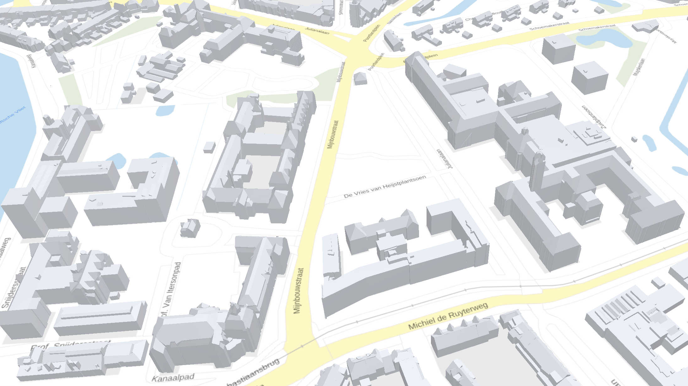

  Delft University of Technology, Netherlands

  **3DGeoInfo 2025**

---

# Motivation and Problem Statement

---

## Traditional vs Cloud-Optimized Geospatial Formats

<!-- _class: columns -->

- ### Traditional Formats

  **Download → Process → Use**

  - Download entire dataset
  - Process locally
  - High bandwidth usage
  - Storage requirements

  Examples: Shapefile, GeoJSON, GeoTIFF

- ### Cloud-Optimized Formats

  **Query → Stream → Use**

  - Partial data retrieval
  - Direct access via HTTP
  - Reduced latency
  - No local storage

  Examples: COG, FlatGeobuf, GeoParquet

---

## The 2D Revolution: Cloud-Optimized Formats

### **A paradigm shift in geospatial data delivery**

- **Cloud Optimized GeoTIFF (COG)**: Raster data with internal tiling
- **FlatGeobuf**: Vector features with spatial indexing
- **GeoParquet**: Columnar storage for analytics
- **PMTiles**: Single-file map tiles

**Key Innovation**:

- **Object storage instead of databases** - Static files on S3/CDN
- **Web-optimized delivery** - HTTP Range Requests for partial access
- **No backend infrastructure** - Direct client-to-storage queries

<!-- ---

## Example: FlatGeobuf in Action

<video width="1000" controls style="display: block; margin: 0 auto;">
  <source src="https://storage.googleapis.com/flatcitybuf/flatgeobuf_demo.mp4" type="video/mp4">
</video>

**Static file + HTTP Range Requests = Dynamic queries** -->

---

## The Gap: 3D City Models Still Behind

<!-- _class: columns -->

- ### Current 3D Distribution

  **3DBAG Example:**
  - Tile-based downloads
  - Choose tiles manually
  - Download complete tiles
  - No partial access

  

- ### The Problem

  **No cloud-optimized format for 3D city models**

  - CityJSON: Text-based, no indexing
  - CityJSONSeq: Streaming, but no spatial queries
  - 3DCityDB: Database-centric, complex setup

  **Research Question:**
  **_"How can we bring cloud optimization to 3D city models?"_**

---

## Solution: FlatCityBuf: A Cloud-Optimised CityJSON Format

### **10-20× faster performance with cloud-native streaming**

  <video width="800" controls style="display: block; margin: 0 auto;">
    <source src="https://storage.googleapis.com/flatcitybuf/demo_1k.mov" type="video/mp4">
  </video>

**Live Demo**: [https://fcb-web-prototype.netlify.app/](https://fcb-web-prototype.netlify.app/)

---

# Methodology

---

<!-- _class: columns -->

## FlatBuffers: General Idea

- #### FlatBuffers

  FlatBuffers is a binary serialisation framework developed by Google.
  Its main characteristics are:

  - Binary format
  - Access to serialised data without parsing
  - Low memory consumption
  - Strictly typed (Schema driven)

- #### JSON

  Compared with FlatBuffers, JSON is:

  - Text-based (Human-readable and interoperable)
  - Needs to parse (copying data is needed)
  - More code to access data

---

## File Structure Design

The file consists of:

1. Magic Bytes: `FCB10000` (Acronym of FlatCityBuf + Semantic versioning)
2. Header: Common properties of CityJSON features and metadata (FlatBuffers root table)
3. Index:
   - Spatial Index: packed Hilbert R-tree
   - Attribute Index: static B+Tree
4. Features: array of CityJSON features (FlatBuffers root table)


---

## 2.3 Header

The header encodes:

- **Core fields**: CityJSON metadata (version, transform, reference system, geographical extent)
- **Appearance**: Materials, textures, UV coordinates
- **Geometry templates**: Reusable structures for compact representation
- **Extension support**: Embedded schemas for self-containment
- **Attribute schema**: Data structure for attributes
- **Indexing metadata**: Metadata for spatial and attribute indexing (e.g. offset bytes and branching factor)

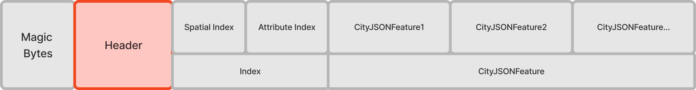

---

## Spatial Indexing: Packed Hilbert R-tree

<!-- _class: columns -->

- ### Construction

  1. Calculate bounding boxes
  2. Map to Hilbert curve
  3. Sort by spatial locality
  4. Build R-tree bottom-up
  5. Pack into linear array

  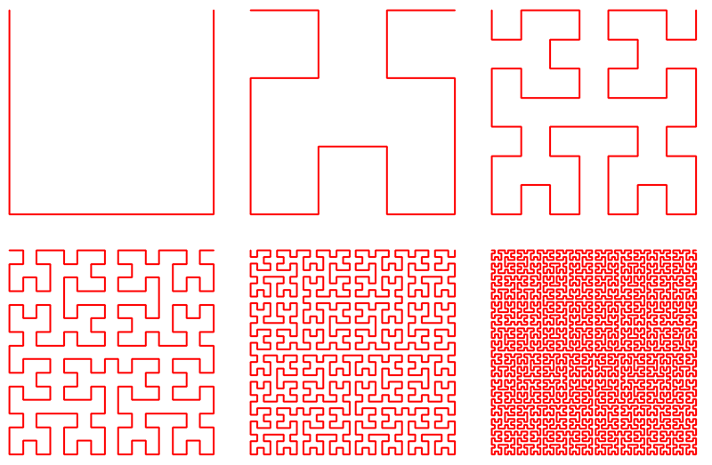_([m Williams, 2022](https://worace.works/2022/02/23/kicking-the-tires-flatgeobuf/))_

- ### Query Support

  - **Bounding box queries** in O(log n)
  - **Point/Nearest neighbor** search

  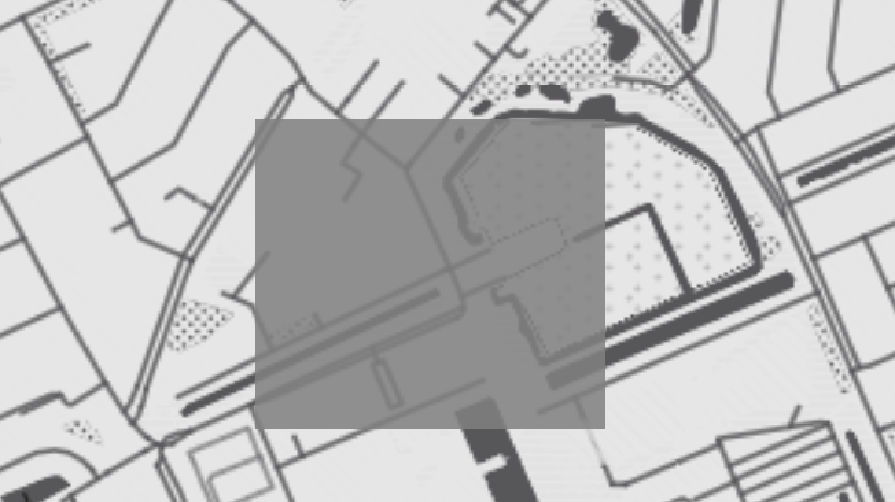

---

## Attribute Indexing: Static B+Tree

<!-- _class: columns -->

- ### Structure

  - **Sort features** by indexed attribute
  - **Build B+Tree** bottom-up
  - **Store keys and pointers** efficiently
  - **Pack into linear array** for disk storage

  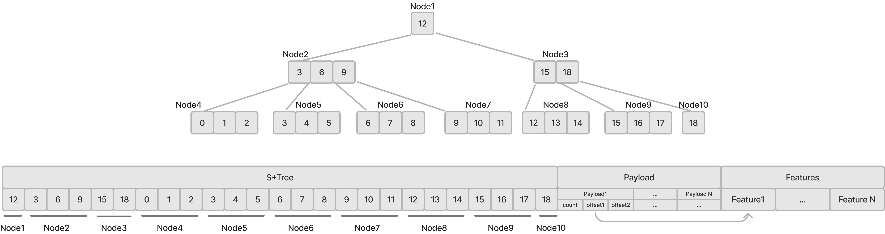

- ### Query Support

  - **Exact Match**: `city = "Tokyo"`
  - **Range Queries**: `year BETWEEN 1990 AND 2000`
  - **Logical Combinations**: `(year > 1990) AND (height > 100)`

---

## 2.6 Feature Encoding: Structure


- **Feature encoding preserves CityJSON structure with FlatBuffers efficiency**
  - **CityFeature**: city objects array, vertices, appearance data
  - **CityObject**: city object type, geometry, attributes, semantics, etc
  - **Flattened arrays**: Parallel structure for nested geometries

---

## HTTP Range Requests: Selective Data Access

<!-- _class: columns -->

- **Traditional Approach**

  ```text
  GET /data.json
  → Download entire file
  → Parse JSON
  → Filter features
  ```

  **Problem**: Downloads whole file, even if only a few features are needed

- **FlatCityBuf Approach**
  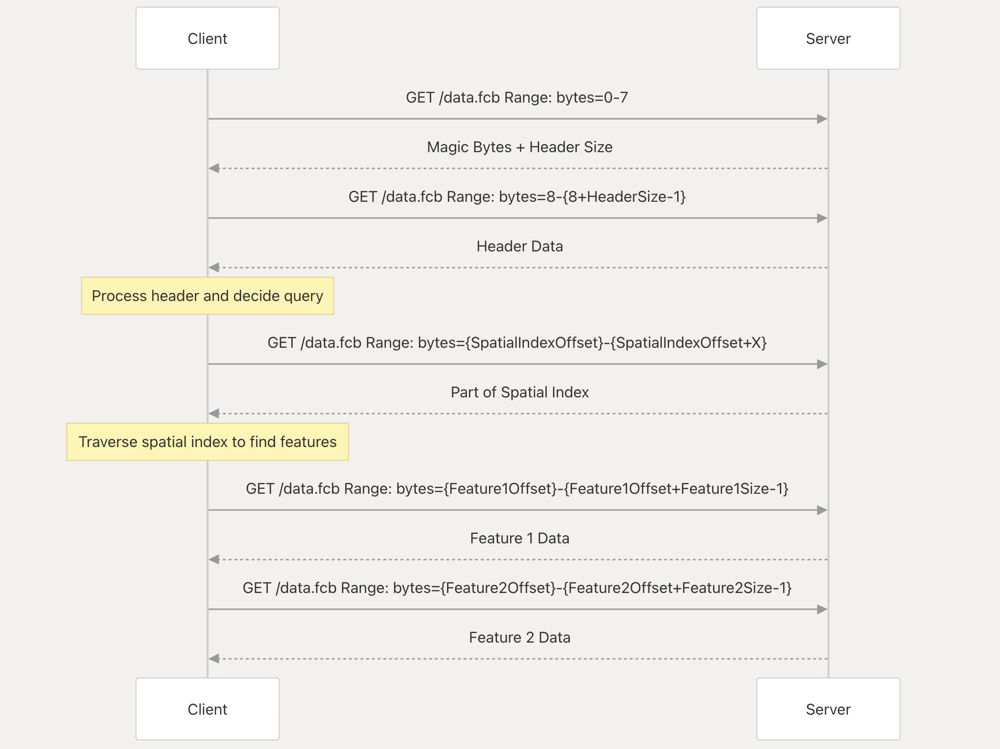

  **Solution**: Only fetch required bytes

---

## Results & Evaluation

---
<!-- _class: columns -->

## Outcomes: Software and Libraries

-
  - 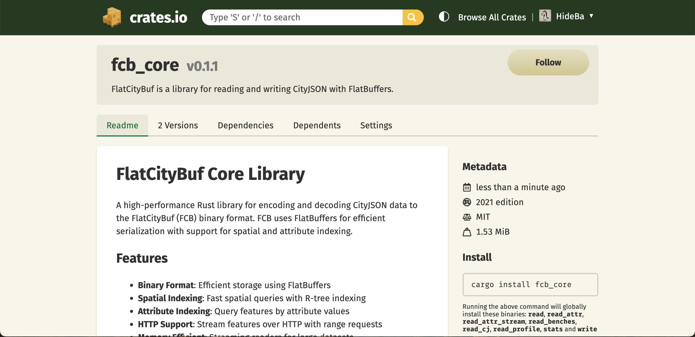
    FlatCityBuf core library (Rust) published on [crates.io](https://crates.io/crates/fcb_core)
  - 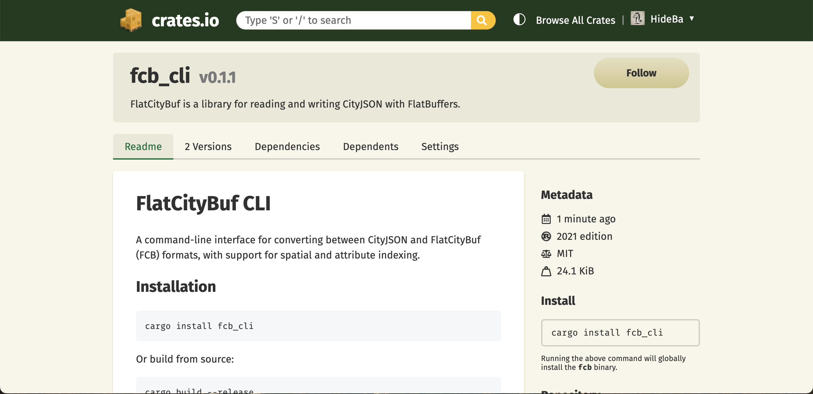
    FlatCityBuf CLI tool (Rust) published on [crates.io](https://crates.io/crates/fcb_cli)
-
  - 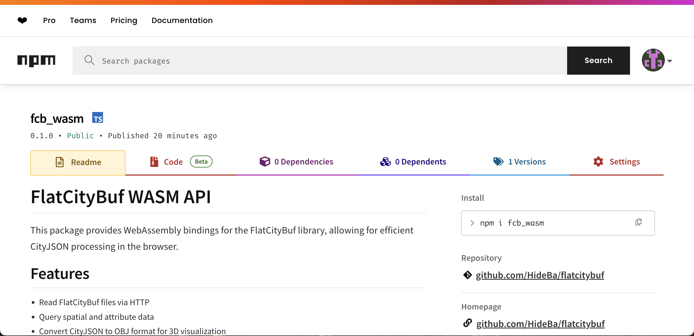
    FlatCityBuf WASM bindings for TypeScript published on [npm](https://www.npmjs.com/package/fcb_wasm)
  - 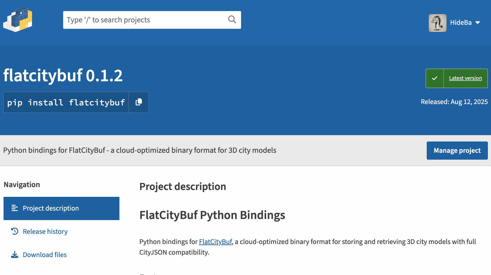
    FlatCityBuf Python bindings published on [pypi](https://pypi.org/project/flatcitybuf/)

---

## Performance Results: Local environment

**Read time 8.6-256.8x faster and 50-80% lower memory usage on local environemnt**
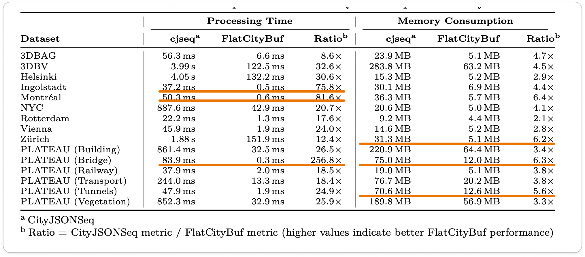

---

## Performance Results: over the network vs 3DBAG API

<!-- _class: columns -->

- ### ID Query Performance

  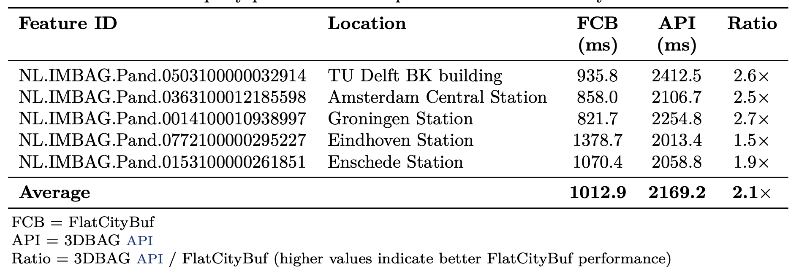

  **2× faster** than 3DBAG API for single feature retrieval

- ### Bounding Box Query

  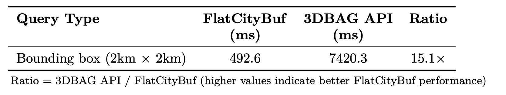

  **15× faster** than 3DBAG API for bounding box queries

---

<!-- _class: columns -->

## Real-World Scale: Netherlands Dataset

- 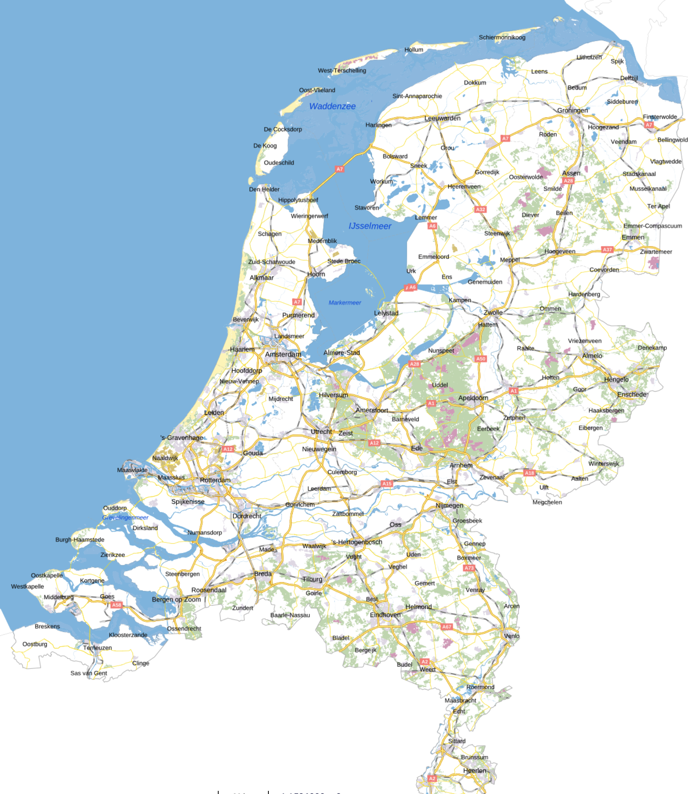

- #### 3DBAG's 10 million buildings are encoded in

  ### **70.4 GB** (single file)

  Data remains accessible for efficient subsetting despite the large file size.

  (Indexed all attributes; without index: 63.9GB. CityJSONSeq: 65.2GB - slightly smaller.)

---

# Discussion & Conclusions

---

<!-- _class: columns -->
## Discussion: Use Cases and Applications

- #### Flexible Data Download

  As the web application showed, users can download only features they want with given queries, even in a data format they prefer e.g. CityJSON, CityJSONSeq, OBJ, etc.

- #### Data Processing Applications

  As performance benchmarks showed, FlatCityBuf is particularly suitable for cases where data processing is I/O intensive such as 3DBAG generation pipeline.

---
<!-- _class: columns -->

## Impact on Server Architecture

- #### Traditional Server Architecture

  Complex, less scalable and expensive

  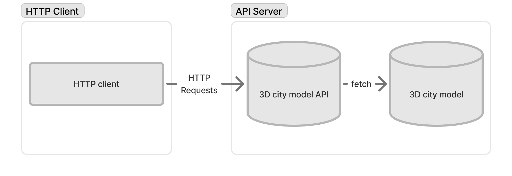

- #### FlatCityBuf's Server Architecture

  Simple, scalable and cost-effective

  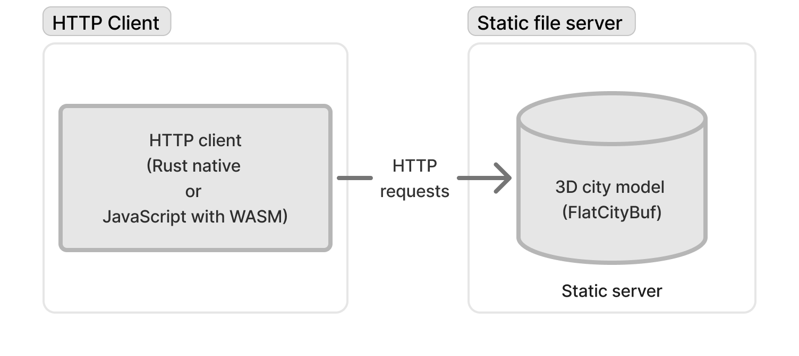

---

## Limitations & Trade-offs

<!-- _class: columns -->

- **Good points:**
  - **Read performance**: Up to 256× faster iteration, 6× lower memory usage
  - **Web streaming**: HTTP Range Requests enable partial data retrieval
  - **Static hosting**: No database servers needed, works with CDN/S3

- **Drawbacks:**
  - **Immutable format**: Updates require rebuilding entire file
  - **Limited query flexibility**: Only spatial and attribute indices supported
  - **Complex client implementation**: client program needs to handle filtering features

  **Best for read-heavy, web-based applications**

---

## Future Work

1. **Supporting multiple languages such as C++**
   - Broader ecosystem adoption
   - Performance-critical applications

2. **Explore other encoding like Parquet**
   - Columnar storage comparison
   - Analytics-optimized formats

3. **Implementing web viewer**
   - Progressive 3D visualization
   - Interactive querying interface

---

## Conclusions

### **FlatCityBuf enables efficient 3D city model streaming**

**Key Contributions:**

- **read performance improvement** through zero-copy deserialization
- **Partial data retrieval** with HTTP Range Requests
- **Practical implementation** with Rust/WASM libraries

**Impact:**
Simplifies server architecture (static files only) and Reduces bandwidth requirements

**Limitations:**
Immutable format, limited query flexibility, and
  complex client implementation

---

## Thank you

**Questions?**


**Resources:**

- Demo: [fcb-web-prototype.netlify.app](https://fcb-web-prototype.netlify.app/)
- Code: [github.com/TUDelft-3D/FlatCityBuf](https://github.com/cityjson/flatcitybuf)

**Contact:**
<h.b.baba@tudelft.nl>

---

# Appendix

---

# Appendix (related work)

---

## Example of Cloud-Optimised Geospatial Formats (2D): FlatGeobuf

<video width="1000" controls style="display: block; margin: 0 auto;">

  <source src="https://storage.googleapis.com/flatcitybuf/flatgeobuf_demo.mp4" type="video/mp4">
</video>

---

# Appendix (Theoretical)

---

## Appendix (Theoretical): Eytzinger Layout (1/2)

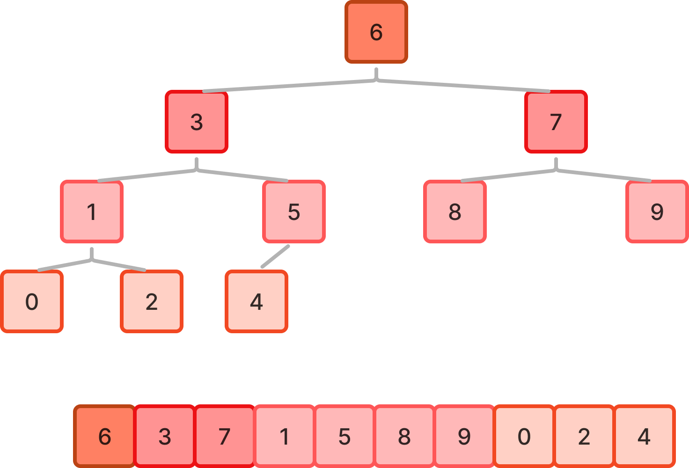

---

## Appendix (Theoretical): Eytzinger Layout (2/2)

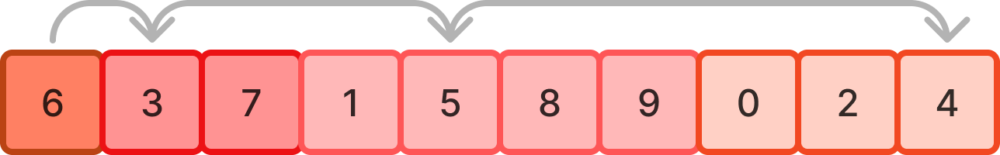

---

### Appendix (Theoretical): Column-oriented and Row-oriented storage

#### Example data

| id  | city      | country        |
| --- | --------- | -------------- |
| 1   | Tokyo     | Japan          |
| 2   | London    | United Kingdom |
| 3   | Amsterdam | Netherlands    |

#### Row-oriented storage

```
1, Tokyo, Japan , 2, London, UK, 3, Amsterdam, Netherlands
```

#### Column-oriented storage

```
1, 2, 3, Tokyo, London, Amsterdam, Japan, UK, Netherlands
```

---

<!-- _class: columns -->

## Appendix (Theoretical): Endianness

- #### Little Endian

  - Least significant byte is stored first
  - Example: 0x12345678
  - Stored as: 0x78 0x56 0x34 0x12
  - e.g. (31 December 2050) in calendar date format

- #### Big Endian

  - Most significant byte is stored first
  - Example: 0x12345678
  - Stored as: 0x12 0x34 0x56 0x78
  - e.g. (2025-12-31) in calendar date format

---

<!-- _class: columns -->

## B-Tree/B+Tree

B-Tree and its variants, B+Tree are self-balancing binary search trees.
With block size B, trees achieve log_B(n) instead of log_2(n) memory accesses.

- #### B-Tree

  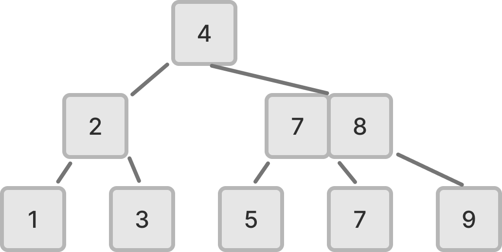

- #### B+Tree

  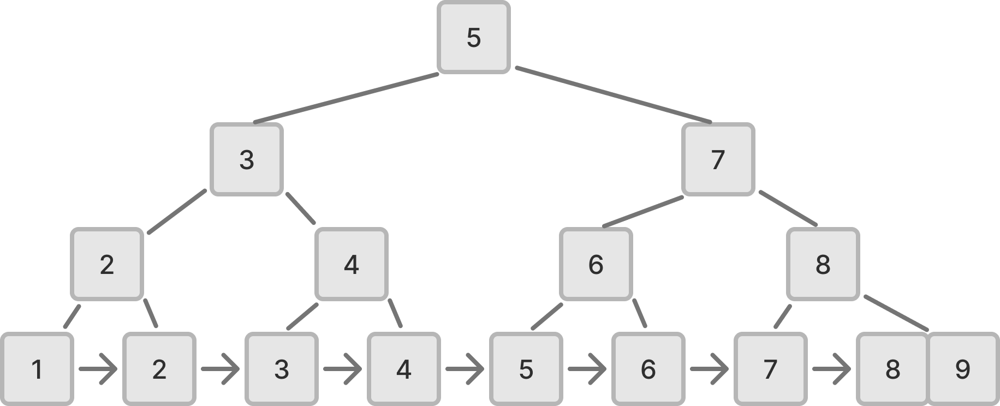

---

<!-- _class: columns -->

## Appendix (Theoretical): WebAssembly

- 
- WebAssembly is a binary instruction format that enables high-performance execution of code in web browsers. It allows languages like C, C++, and Rust to run at near-native speed on the web.

---

## Appendix (Theoretical): FlatBuffers

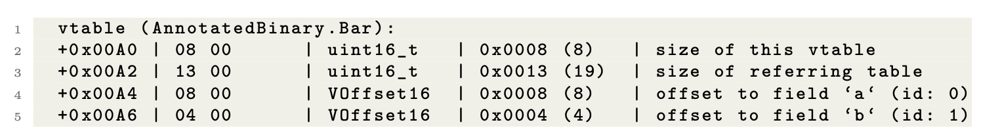

---

<!-- _class: columns -->

## FlatBuffers: Zero-copy

- #### Multiple Copies of the Same Data

  When data is processed on a machine, it is often copied multiple times.

  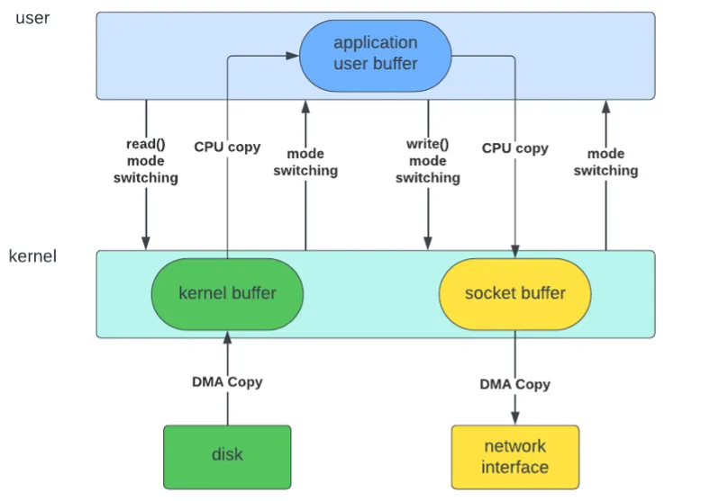
  _([Zhenyuan (Zane) Zhang, 2024](https://medium.com/@kaixin667689/zero-copy-principle-and-implementation-9a5220a62ffd))_

- #### Zero-copy

  Zero-copy avoids data copying between memory locations, reducing I/O overhead. Formats like FlatBuffers enable direct access to serialised data without deserialisation.
  **Though the term "zero" is often used, it's not necessarily zero. It implies the data is copied much less than other approaches.**

---

## Appendix: Scope of the Research

- **In scope:**

  - FlatCityBuf format design and implementation (Rust)
  - Spatial and attribute indexing
  - HTTP Range Request data retrieval
  - Performance evaluation vs CityJSONSeq
  - Web-based demo

- **Out of scope:**
  - Implementing libraries in other programming languages
  - Exploring alternative serialisation frameworks like Parquet or Protocol Buffers
  - Optimising for write operations

---

# Appendix: Methodology

---
<!-- _class: columns -->

## Spatial Indexing (1/4): General Idea

- #### R-tree

  R-tree is a spatial index structure for 2D and 3D data.
  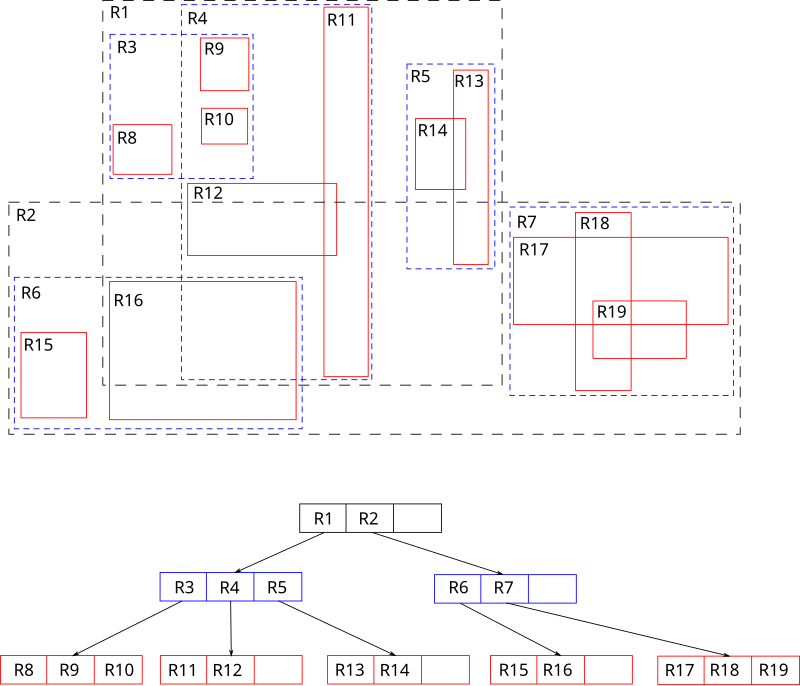
  _([Wikipedia, 2025](https://en.wikipedia.org/wiki/R-tree))_

- #### Space-filling Curves

  Space-filling curves such as Hilbert curve map multi-dimensional data to one dimension while preserving spatial locality.
  
  _([m Williams, 2022](https://worace.works/2022/02/23/kicking-the-tires-flatgeobuf/))_

## Spatial Indexing (2/4): Structure

**Spatial Index in the file**


**Packed Hilbert R-tree**

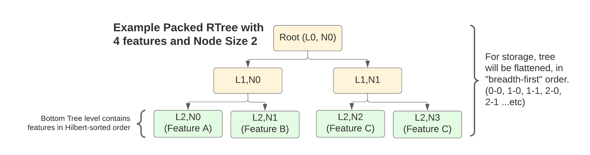
_([m Williams, 2022](https://worace.works/2022/02/23/kicking-the-tires-flatgeobuf/))_

---

## Spatial Indexing (3/4): Construction Steps

1. **Calculate bounding boxes**: Compute BBox for each feature
2. **Hilbert curve mapping**: Map BBox centres to Hilbert curve positions
3. **Sort by Hilbert value**: Order features to maintain spatial locality
4. **Build R-tree bottom-up**: Group features into leaf nodes, build parent nodes
5. **Pack into linear array**: Serialise tree into contiguous memory layout

---

<!-- _class: columns -->

## Spatial Indexing (4/4): Supported Queries

### Spatial indexing in a streaming manner

- #### Bounding Box

  

- #### Point/Nearest Neighbour

  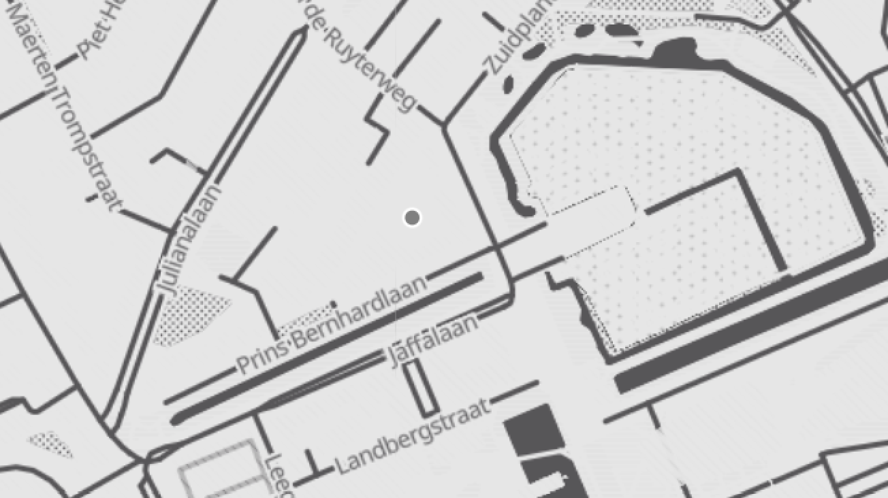

---

## Attribute Indexing (1/3): Structure

**Attribute Index in the file**


**Static B+Tree**


---

## Attribute Indexing (2/3): Construction Steps

1. **Sort features by attribute**: Order features by the indexed attribute value (e.g. `1.apple`, `2.banana`, `3.cherry`)
2. **Build B+Tree bottom-up**: Create leaf nodes with sorted features, build internal nodes
3. **Store keys and pointers**: Internal nodes store keys and child pointers, leaves store actual data
4. **Pack into linear array**: Serialise tree structure for efficient disk storage
5. **Create index metadata**: Store root offset, node size, and branching factor

---

## Attribute Indexing (3/3): Supported Queries

**Attribute indexing is also in a streaming manner!**

- **Exact Match Queries**

  - Find features with specific attribute values
  - Example: `city = "Tokyo"`

- **Range Queries**

  - Find features within attribute value ranges (`<`, `<=`, `>`, `>=`)
  - Example: `construction_year BETWEEN 1990 AND 2000`

- **Logical Combinations**

  - Find features that satisfy multiple conditions
  - Example: `(construction_year > 1990) AND (height > 100)`

---

<!-- _class: columns -->

## Feature Encoding (2/3): Geometry Encoding

FlatBuffers does not support nested arrays. We use flattened arrays to represent nested geometries.

- **Example (Triangle)**

  ```
  boundaries : [0 , 1 , 2]
  strings : [3]
  surfaces : [1]
  ```

  

- **Example (Cube)**

  ```
  boundaries : [0 , 1 , 2 , 3 , 0 , 3 , 7 , 4 ...]
  strings : [4 , 4 , 4 , 4 , 4 , 4]
  surfaces : [1 , 1 , 1 , 1 , 1 , 1]
  shells : [6]
  solids : [1]
  ```

  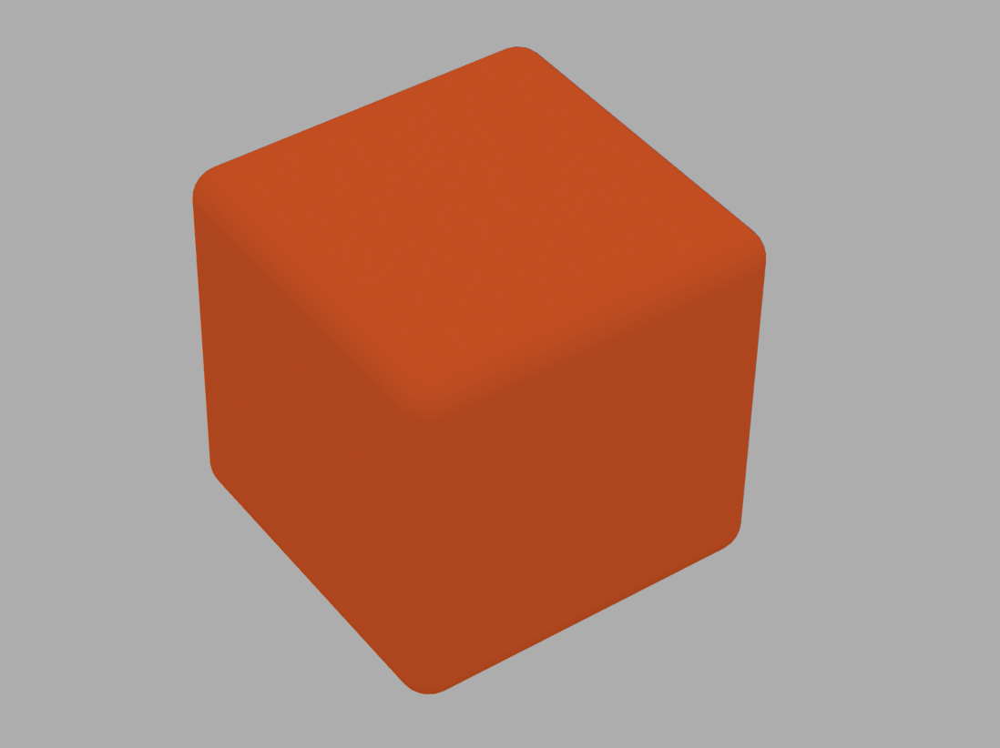

---

---

<!-- _class: columns -->

## 2.6 Feature Encoding (2/3): Geometry Encoding

FlatBuffers does not support nested arrays. We use flattened arrays to represent nested geometries.

- **Example (Triangle)**

  ```
  boundaries : [0 , 1 , 2]
  strings : [3]
  surfaces : [1]
  ```

  

- **Example (Cube)**

  ```
  boundaries : [0 , 1 , 2 , 3 , 0 , 3 , 7 , 4 ...]
  strings : [4 , 4 , 4 , 4 , 4 , 4]
  surfaces : [1 , 1 , 1 , 1 , 1 , 1]
  shells : [6]
  solids : [1]
  ```

  

---

## Feature Encoding (3/3): Attribute Encoding

Attributes are encoded with their own binary representation. (in little endian)

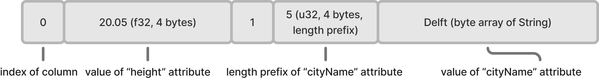

---

# Appendix A: Results & Evaluation

---

## Appendix A: File Size Comparison (Level of Detail)

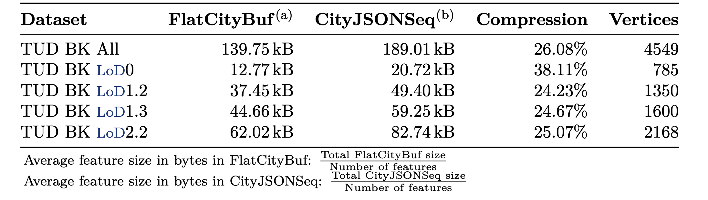

---

<!-- _class: columns -->

## Appendix A: File Size Comparison (Attribute Quantity)

- #### Data

  ```json
  {
    "type ": "Building",
    "geometry ": [ . . . ] ,
    "attributes ": {
    "attr_1": "value_1",
    "attr_2": "value_2",
    "attr_3": "value_3",
    "attr_4": "value_4",
    "attr_5": "value_5",
    ...
    "attr_n": " value_n"
    }
  }
  ```

- #### Result

  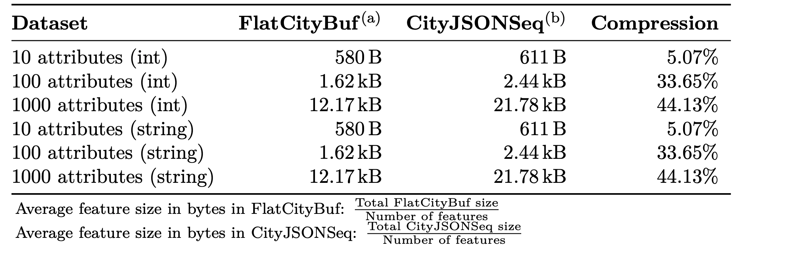

---

<!-- _class: columns -->

## Appendix A: File Size Comparison (Geometric Complexity)

- #### Data

  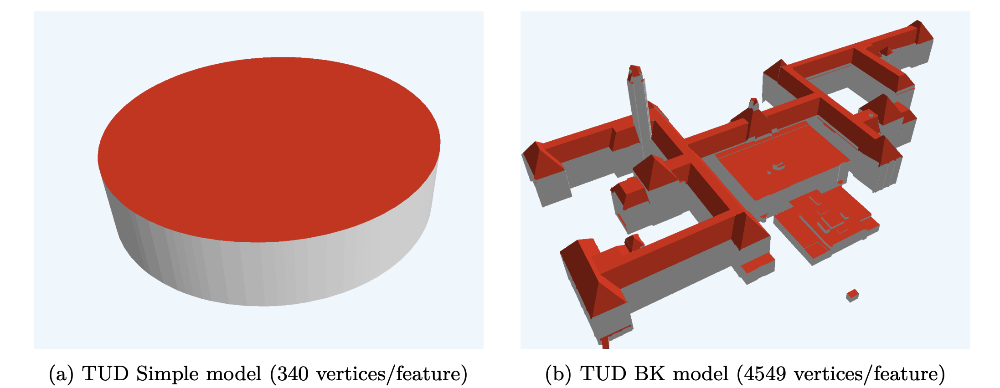

- #### Result

  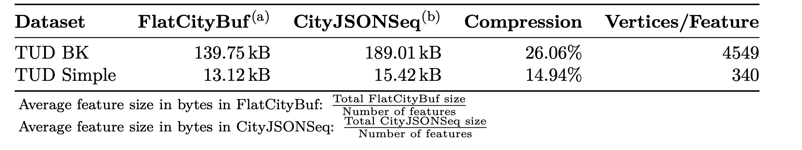

---

## Appendix A: File Size Comparison (Coordinate Scale)

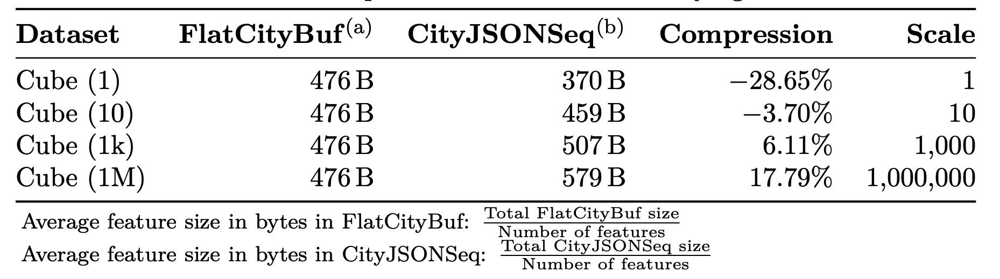

--

## Appendix A: Read Performance (vs CityJSONSeq)


---

## Appendix A: Read Performance (vs CBOR)

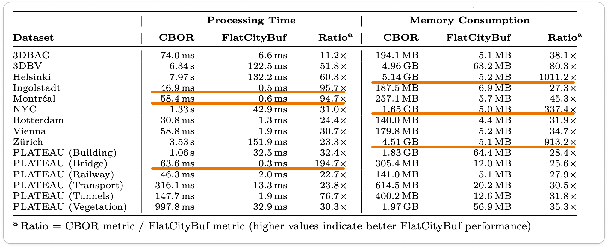
