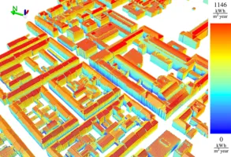
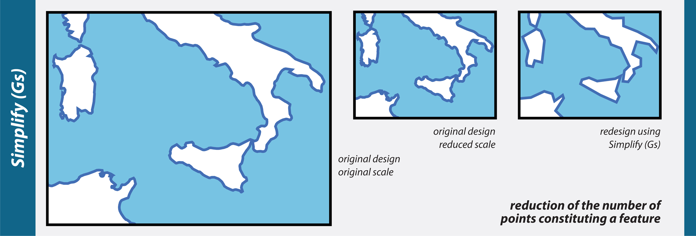
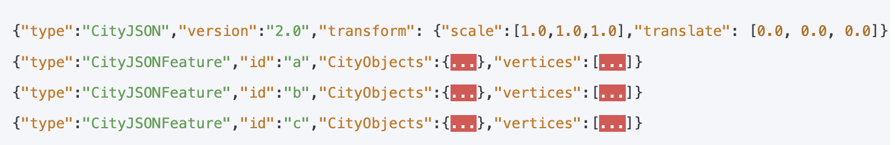
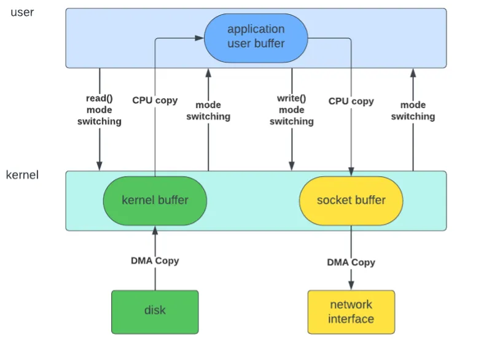
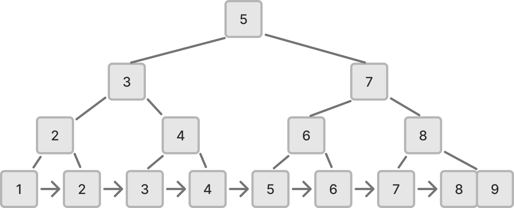
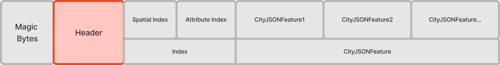
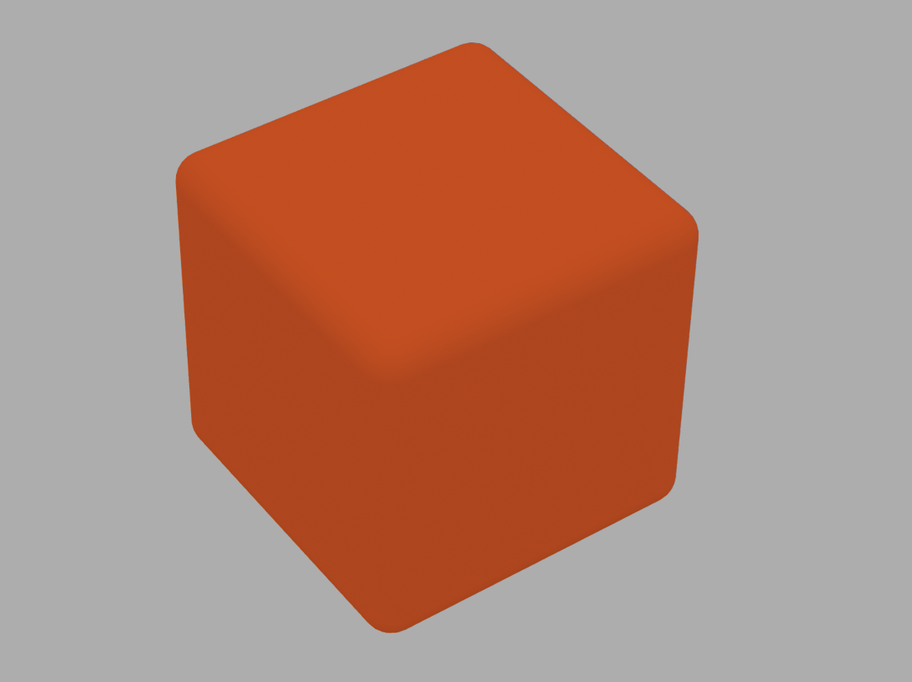
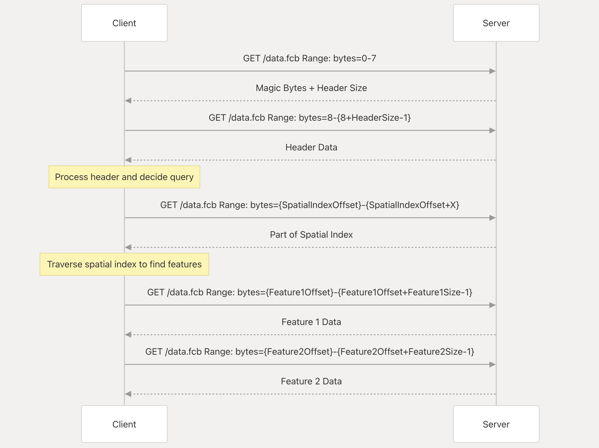

# FlatCityBuf: a new cloud-optimised CityJSON format

<!-- _class: columns -->

- ## Hidemichi Baba

  

  student #5967538
  h.baba@student.tudelft.nl

  - Responsible Supervisor: Hugo Ledoux
  - 2nd Supervisor: Ravi Peters
    18th June 2025

- 

---

<!-- _class: columns -->

## Index

- - **1. Background & Motivation**

    - What are 3D City Models?
    - Current Challenges in Cloud GIS
    - Why This Research Matters

  - **2. Theoretical Foundation**

    - Binary vs Text-Based Formats
    - Zero-Copy and Performance
    - Serialisation/Deserialisation and frameworks
    - FlatBuffers
    - Spatial Indexing
    - B-Tree/B+Tree

  - **3. Related Work**

    - CityGML and CityJSON
    - CityJSON and its variants
    - Cloud-Optimised Geospatial Formats
    - Research Gap Identification

- - **4. Research Objectives**

    - Primary Research Question
    - Technical Goals
    - Scope and Limitations

  - **5. FlatCityBuf Solution**

    - Technical Approach Overview
    - Key Innovations
    - File Structure Design

  - **6. Implementation & Results**

    - Performance Benchmarks
    - Web Prototype Demo
    - Real-World Comparisons

  - **7. Impact & Applications**

    - Use Cases and Benefits
    - Architecture Simplification
    - Cost Implications

  - **8. Discussion & Future Work**

    - Limitations and Trade-offs
    - Next Steps
    - Broader Implications

---

# 1. Background & Motivation

---

<!-- _class: columns -->

## What are 3D City Models?

Digital representations of urban environments including buildings, infrastructure, and terrain with rich semantic data.

- 
  _PLATEAU: Japan's national 3D city model initiative_

- 
  _3DBAG: Netherlands' comprehensive 3D building dataset_

---

<!-- _class: columns -->

## How are 3D City Models used?

- #### Example1: Solar Analysis

  
  _([Technical University of Munich](https://www.asg.ed.tum.de/en/gis/research-areas/cities-and-energy/), 2024)_

- #### Example2: Flood Simulation

  
  _([PLATEAU](https://plateauview.mlit.go.jp/), 2024)_

---

<!-- _class: columns -->

## Traditional Desktop GIS vs Cloud GIS

- ### Desktop GIS

  Desktop GIS uses data on the local machine.

  

- ### Cloud GIS

  Cloud GIS uses data transferred over the network.

  

---

<!-- _class: columns -->

## Common strategies for Cloud GIS

- 1. #### Tiling

  
  _Tile Map Service (TMS) standard_

  2. #### Spatial Indexing

     e.g. R-tree, quadtree, KD-tree

- 3. #### Data Simplification

  
  _([Roth et al., 2011](https://cartographicperspectives.org/index.php/journal/article/view/cp68-roth-et-al/html))_

  4. #### Compression
     e.g. Draco, or other binary formats

---

## How about 3DBAG?

<!-- _class: center -->

3DBAG also employs tiling for data download. User need to choose tiles containing their area of interest.


---

<!-- _class: columns -->

## Cloud-Optimised Geospatial Formats (2D)

- ### Cloud-Optimised

  Cloud-optimised geospatial formats enable efficient on-demand access to geospatial data, offering four key advantages:

  - **Reduced latency** through partial data retrieval
  - **Scalability** via parallel operations
  - **Flexibility** with advanced query capabilities
  - **Cost-effectiveness** through optimised access patterns

- ### Examples

  - Cloud Optimised GeoTIFF
  - GeoParquet
  - PMTiles
  - FlatGeobuf
  - 3D Tiles
  - Mapbox Vector Tiles

---

## Research Gap

### There is no cloud-optimised format for 3D city models...

---

## Research Question

_"How can CityJSONSeq encoding be optimized for faster access, lower memory consumption, and flexible feature querying in web environments?"_

---

## Research sub-questions

- **RQ1:** How can a FlatBuffers schema be designed to efficiently represent all components of CityJSONSeq while maintaining semantic richness?

- **RQ2:** How can spatial and attribute queries achieve logarithmic time complexity through optimized indexing structures?

- **RQ3:** How can web-based data subset retrieval be implemented efficiently using HTTP Range Requests with binary serialization?

The proposed **FlatCityBuf** format combines FlatBuffers' binary serialization with HTTP Range Requests, prioritizing read performance over update capabilities while maintaining CityJSON's semantic richness.

---

## Scope of the research

- **In scope:**

  - FlatCityBuf format design and implementation (Rust)
  - Spatial and attribute indexing
  - HTTP Range Request data retrieval
  - Performance evaluation vs CityJSONSeq
  - Web-based demo

- **Out of scope:**
  - Implementing libraries in other programming languages
  - Exploring alternative serialization frameworks like Parquet or Protocol Buffers
  - Optimizing for write operations

---

# 2. Theoretical Foundation & Related Work

---

<!-- _class: columns -->

## CityGML and CityJSON

- #### CityGML

  CityGML is an conceptual model for representing and exchanging 3D city models with semantic information.

  
  _([CityGML 3.0.0](https://www.ogc.org/standards/citygml/))_

- #### CityJSON

  CityJSON is a OGC community standard for representing CityGML model in JSON format.

  
  _([CityJSON](https://www.cityjson.org/))_

---

<!-- _class: columns -->

## CityJSON and its variants

Ledoux et al., 2024 proposed CityJSON TextSequences (CityJSONSeq) so features can be processed/delivered in a streaming manner.

Features are decomposed into individual JSON objects.


_([Ledoux et al., 2024](https://isprs-archives.copernicus.org/articles/XLVIII-4-W11-2024/57/2024/))_

**However, there are still room for improvement!**

---

<!-- _class: columns -->

## Binary files

- - Binary files offer superior storage efficiency and faster processing than text formats.

  - Of course, not human readable.

  - Common text formats: GeoJSON, CSV, CityGML, and CityJSON

  - Common binary formats: GeoPackage and GeoTIFF, etc

- 

---

## Serialisation/Deserialisation

- Serialisation: Convert data from memory/object representation to a storable/transmittable format. Also called marshalling/flattening/pickling, etc.
- Deserialisation: Convert data from a storable/transmittable format back to memory/object representation.

## Frameworks/Standards

- JSON
- FlatBuffers
- Protocol Buffers
- Parquet
- etc

---

<!-- _class: columns -->

## Zero-copy

- #### Multiple copies of the same data

  When data is processed on a machine, it is often copied multiple times.

  
  _([Zhenyuan (Zane) Zhang, 2024](https://medium.com/@kaixin667689/zero-copy-principle-and-implementation-9a5220a62ffd))_

- #### Zero-copy

  Zero-copy avoids data copying between memory locations, reducing I/O overhead. Formats like FlatBuffers enable direct access to serialized data without deserialization.
  **Though the term "zero" oftern used, it's not neccesally zero. It implies the data is copied much less than other approaches.**

---

<!-- _class: columns -->

## FlatBuffers and other formats

<!--  -->

- #### FlatBuffers

  FlatBuffers is a binary serialization framework developed by Google.
  It's main characteristics are:

  - Binary format
  - Access to serialised data without parsing
  - Low memory consumption
  - Strictly typed (Schema driven)

- #### JSON

  Compared with FlatBuffers, JSON is:

  - Text-based (Human-readable and interoperable)
  - Need to parse (copying data is needed)
  - more code to access data

---

<!-- _class: columns -->

## Spatial Indexing

- #### R-tree

  R-tree is a spatial index structure for 2D and 3D data.
  
  _([Wikipedia, 2025](https://en.wikipedia.org/wiki/R-tree))_

- #### Space-filling curves

  Space-filling curves such as Hilbert curve map multi-dimensional data to one dimension while preserving spatial locality.
  
  _([m Williams, 2022](https://worace.works/2022/02/23/kicking-the-tires-flatgeobuf/))_

---

<!-- _class: columns -->

## B-Tree/B+Tree

B-Tree and its variants, B+Tree are self-balancing binary search trees.
With block size B, trees achieve log_B(n) instead of log_2(n) memory accesses.

- #### B-Tree

  

- #### B+Tree
  

---

# 3. Methodology

---

## File Structure

The file consists of:

1. Magic Bytes: `FCB10000` (Acronym of FlatCityBuf + Semantic versioning)
2. Header: Common properties of CityJSON features and meta data (FlatBuffers root table)
3. Index:
   - Spatial Index: packed Hilbert R-tree
   - Attribute Index: static B+Tree
4. Features: array of CityJSON features (FlatBuffers root table)


---

## Header

The header encodes:

- **Core fields**: CityJSON metadata (version, transform, reference system, geographical extent)
- **Appearance**: Materials, textures, UV coordinates
- **Geometry templates**: Reusable structures for compact representation
- **Extension support**: Embedded schemas for self-containment
- **Attribute schema**: Data structure for attributes
- **Indexing metadata**: Metadata for spatial and attribute indexing (e.g. offset bytes and branching factor)



---

## Spatial Indexing (1/3): structure

**Spatial Index in the file**


**packed Hilbert R-tree**


_([m Williams, 2022](https://worace.works/2022/02/23/kicking-the-tires-flatgeobuf/))_

---

## Spatial Indexing (2/3): construction steps

1. **Calculate bounding boxes**: Compute MBR for each feature
2. **Hilbert curve mapping**: Map MBR centers to Hilbert curve positions
3. **Sort by Hilbert value**: Order features to maintain spatial locality
4. **Build R-tree bottom-up**: Group features into leaf nodes, build parent nodes
5. **Pack into linear array**: Serialize tree into contiguous memory layout

---

<!-- _class: columns -->

## Spatial Indexing (3/3): Supported queries

- #### Bounding box

  

- #### Point/nearest neighbour

  

---

## Attribute Indexing (1/3): structure

**Attribute Index in the file**


**static B+Tree**


---

## Attribute Indexing (2/3): construction steps

1. **Sort features by attribute**: Order features by the indexed attribute value (e.g. `1.apple`, `2.banana`, `3.cherry`)
2. **Build B+Tree bottom-up**: Create leaf nodes with sorted features, build internal nodes
3. **Store keys and pointers**: Internal nodes store keys and child pointers, leaves store actual data
4. **Pack into linear array**: Serialize tree structure for efficient disk storage
5. **Create index metadata**: Store root offset, node size, and branching factor

---

## Attribute Indexing (3/3): Supported queries

- #### Exact match queries

  - Find features with specific attribute values
  - Example: `city = "Tokyo"`

- #### Range queries

  - Find features within attribute value ranges (`<`, `<=`, `>`, `>=`)
  - Example: `construction_year BETWEEN 1990 AND 2000`

- #### Logical combinations

  - Find features that satisfy multiple conditions
  - Example: `(construction_year > 1990) AND (height > 100)`

---

## Feature Encoding (1/3): structure


- **Feature encoding preserves CityJSON structure with FlatBuffers efficiency**
  - **CityFeature**: Metadata, city objects array, vertices, appearance data
  - **CityObject**: city object type, geometry, attributes, semantics, etc
  - **Flattened arrays**: Parallel structure for nested geometries

---

<!-- _class: columns -->

## Feature Encoding (2/3): Geometry encoding

FlatBuffers does not support nested arrays. We use flattened arrays to represent nested geometries.

- **Example (Triangle)**

  ```
  // Indices of three vertices
  boundaries : [0 , 1 , 2]
  // Single string with 3 vertices
  strings : [3]
  // Single surface containing 1 string
  surfaces : [1]
  ```

  

- **Example (Cube)**

  ```
  boundaries : [0 , 1 , 2 , 3 , 0 , 3 , 7 , 4 ...]
  strings : [4 , 4 , 4 , 4 , 4 , 4]
  surfaces : [1 , 1 , 1 , 1 , 1 , 1]
  shells : [6]
  solids : [1]
  ```

  

---

## Feature Encoding (3/3): Attribute encoding

Attributes are encoded with own binary representation. (in little endian)


---

<!-- _class: columns -->

## HTTP Range Requests

- HTTP Range Requests are used to retrieve only the necessary data from the file. Multiple HTTP Range Requests are sent to fetch only features user wants.

- 

---

# 4. Results & Analysis

---

## Outcomes: Web Prototype Demo

<video width="1000" controls style="display: block; margin: 0 auto;">
  <source src="https://storage.googleapis.com/flatcitybuf/demo_1k.mov" type="video/mp4">
</video>

---

<!-- _class: columns -->

## Evaluation metrics

- #### File size

  I comapre the serilised files size of:

  - CityJSONSeq
  - FlatCityBuf
  - CBOR (JSON compatible binary format)
  - BSON (JSON compatible binary format)

- #### Read performance on local machine

  - Time to iterate all features
  - Peak memory usage (RSS)

- #### Read performance over network (vs 3DBAG API)

  - Time for ID-based queries
  - Time for bounding box queries

---

## File size comparison (1/2): Overview


---

<!-- _class: columns -->

## File size comparison (2/2): factors

- #### Key factors:

  - **Level of Detail**: Minimal impact (~24-25% consistent compression)
  - **Attribute Quantity**: More attributes = better compression (5.07% → 44.13%)
  - **Geometric Complexity**: Complex geometries compress better (14.94% → 26.06%)
  - **Coordinate Scale**: Large coordinates favor FlatCityBuf (-28.65% → +17.79%)

- #### FlatCityBuf achieves better compression when:

  - More attributes
  - Complex geometries
  - Large coordinate values

---

## Local Environment Benchmarks(1/4): Overview

**Key findings:**

- FlatCityBuf consistently outperforms alternatives in both speed and memory efficiency
- 2-10x faster iteration compared to text-based formats (CityJSONSeq)
- 50-80% lower memory usage across all test cases
- Performance advantage increases with dataset complexity

---

## Local Environment Benchmarks(2/4): vs CityJSONSeq


---

## Local Environment Benchmarks(3/4): vs CBOR


---

## Local Environment Benchmarks(4/4): vs BSON


---

## Web Environment Benchmarks vs 3DBAG API(1/2)

### ID query


---

## Web Environment Benchmarks vs 3DBAG API(2/2)

### Bounding box query


---

# 5. Discussion

---

# Appendix

---

## Appendix A: File size comparison (Level of Detail)

---

## Appendix A: File size comparison (Attribute Quantity)

---

## Appendix A: File size comparison (Geometric Complexity)

---

## Appendix A: File size comparison (Coordinate Scale)
