# FlatCityBuf: a new cloud-optimised CityJSON format

<!-- _class: columns -->

- ## Hidemichi Baba

  

  student #5967538
  h.baba@student.tudelft.nl

  - Responsible Supervisor: Hugo Ledoux
  - 2nd Supervisor: Ravi Peters
    18th June 2025

- 

---

<!-- _class: columns -->

## Index

- - **1. Background & Motivation**

    - What are 3D City Models?
    - Cloud GIS Challenges
    - Research Gap & Question

  - **2. Theoretical Foundation**

    - CityJSON and Variants
    - Binary Serialisation & FlatBuffers
    - Spatial & Attribute Indexing

  - **3. Methodology**

    - File Structure Design
    - Indexing Mechanisms
    - HTTP Range Requests

- - **4. Results & Analysis**

    - Implementation Outcomes
    - Performance Benchmarks
    - Web Environment Testing

  - **5. Discussion**

    - Use Cases & Applications
    - Architecture Impact
    - Limitations

  - **6. Conclusion & Future Work**

    - Key Contributions
    - Future Directions

---

# 1. Background & Motivation

---

<!-- _class: columns -->

## 1.1 3D City model (1/3): What is it?

Digital representations of urban environments including buildings, infrastructure, and terrain with rich semantic data.

- 
  _PLATEAU: Japan's national 3D city model initiative_

- 
  _3DBAG: Netherlands' comprehensive 3D building dataset_

---

<!-- _class: columns -->

## 1.1 3D City model (2/3): How is it used?

- #### Example 1: Solar Analysis

  
  _([Technical University of Munich](https://www.asg.ed.tum.de/en/gis/research-areas/cities-and-energy/), 2024)_

- #### Example 2: Flood Simulation

  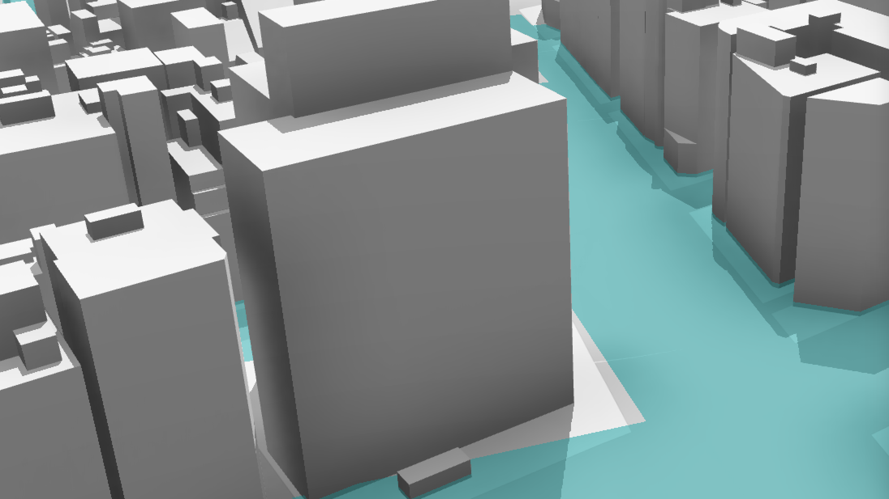
  _([PLATEAU](https://plateauview.mlit.go.jp/), 2024)_

---

<!-- _class: columns -->

## 1.1 3D City model (3/3): How is it represented? (CityGML and CityJSON)

- #### CityGML

  CityGML is a conceptual model for representing and exchanging 3D city models with semantic information.

  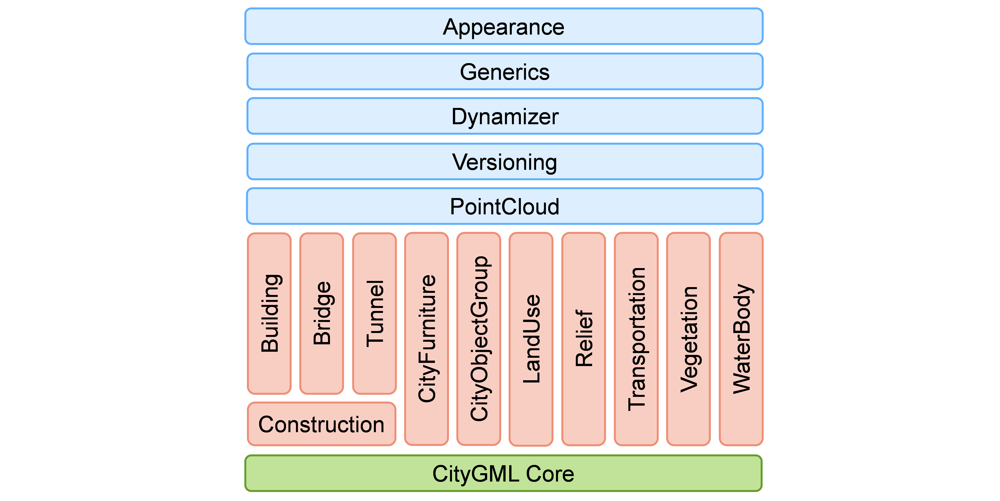
  _([CityGML 3.0.0](https://www.ogc.org/standards/citygml/))_

- #### CityJSON

  CityJSON is an OGC community standard for representing CityGML models in JSON format.

  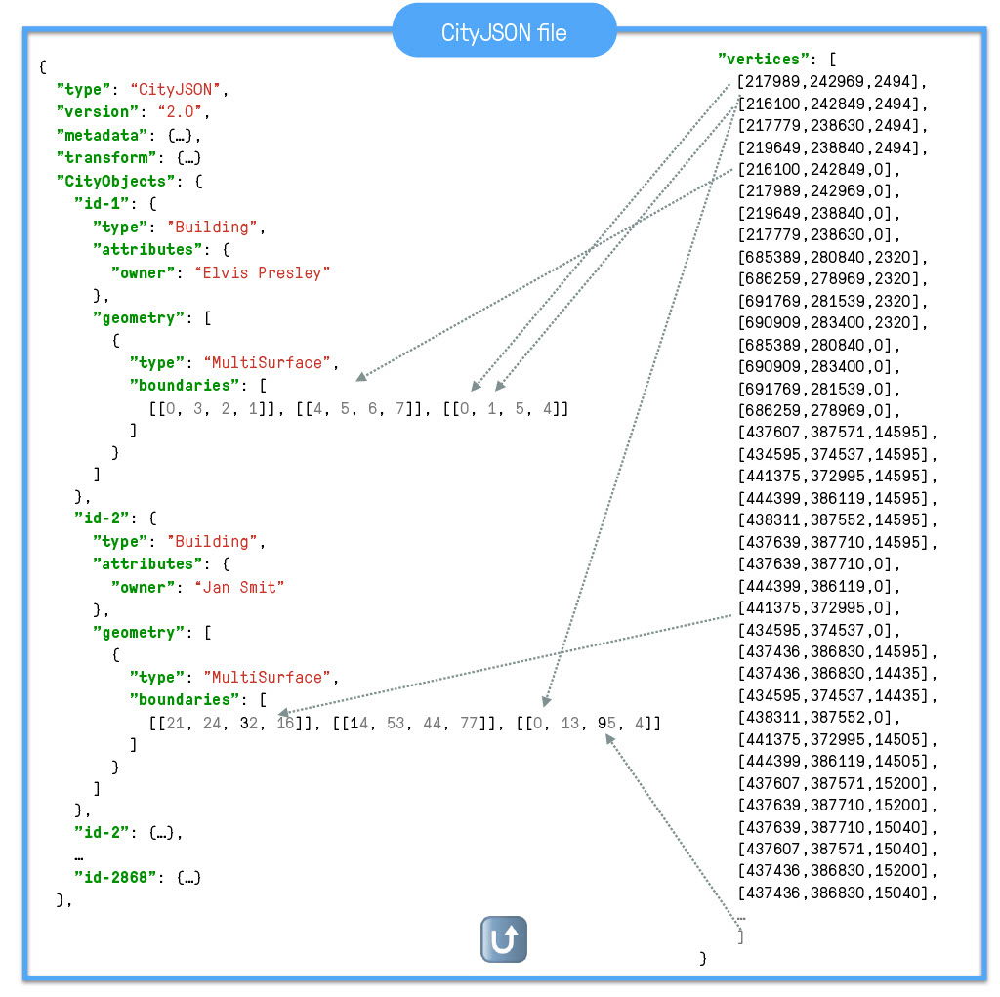
  _([CityJSON](https://www.cityjson.org/))_

---

<!-- _class: columns -->

## 1.4 Traditional Desktop GIS vs Cloud GIS

- ### Desktop GIS

  Desktop GIS uses data on the local machine.

  

- ### Cloud GIS

  Cloud GIS uses data transferred over the network.

  

---

<!-- _class: columns -->

## 1.5 Benefits and Challenges of Cloud GIS

- #### Benefits

  - **Global accessibility** - access from anywhere
  - **Multi-user collaboration** - simultaneous data access
  - **Cross-platform compatibility** - works on any device
  - **Scalable infrastructure** - handles varying demands
  - **Reduced storage** - no local data storage needed

- #### Challenges

  - **Network dependency** - requires stable internet
  - **Data transfer costs** - bandwidth consumption
  - **Latency issues** - network delays affect performance
  - **Security concerns** - data stored externally

---

<!-- _class: columns -->

## Common Strategies for Cloud GIS

- 1. #### Tiling

  
  _Tile Map Service (TMS) standard_

  2. #### Spatial Indexing

     e.g. R-tree, quadtree, KD-tree

- 3. #### Data Simplification

  
  _([Roth et al., 2011](https://cartographicperspectives.org/index.php/journal/article/view/cp68-roth-et-al/html))_

  4. #### Compression
     e.g. Draco, or other binary formats

---

<!-- _class: columns -->

## Cloud-Optimised Geospatial Formats (2D)

- ### Cloud-Optimised

  Cloud-optimised geospatial formats enable efficient on-demand access to geospatial data, offering four key advantages:

  - **Reduced latency** through partial data retrieval
  - **Scalability** via parallel operations
  - **Flexibility** with advanced query capabilities
  - **Cost-effectiveness** through optimised access patterns

- ### Examples

  - Cloud Optimised GeoTIFF
  - GeoParquet
  - PMTiles
  - FlatGeobuf
  - 3D Tiles
  - Mapbox Vector Tiles

---

## Example of Cloud-Optimised Geospatial Formats (2D): FlatGeobuf

<video width="1000" controls style="display: block; margin: 0 auto;">

  <source src="https://storage.googleapis.com/flatcitybuf/flatgeobuf_demo.mp4" type="video/mp4">
</video>

---

## Example of Cloud-Optimised Geospatial Formats (2D): FlatGeobuf

FlatGeobuf is a static file such as .png, .mp4, .geojson, etc.
However, it allows you to access **subset of the data with bounding box queries**.

[Brandon Liu](https://x.com/bdon) says
<br/>

> A Map is just a Video

---

## How about 3DBAG?

<!-- _class: center -->

3DBAG also employs tiling for data download. Users need to choose tiles containing their area of interest.


---

<!-- _class: columns -->

## CityJSON's Variants: CityJSONSeq

Ledoux et al., 2024 proposed CityJSON TextSequences (CityJSONSeq) so features can be processed/delivered in a streaming manner.

Features are decomposed into individual JSON objects.


_([Ledoux et al., 2024](https://isprs-archives.copernicus.org/articles/XLVIII-4-W11-2024/57/2024/))_

**However, there is still room for improvement!**

---

## Research Gap

### There is no cloud-optimised format for 3D city models...

### What if we can apply the same idea of FlatGeobuf to 3D city models?

---

## Research Question

### _"How can CityJSONSeq encoding be optimised for faster access, lower memory consumption, and flexible feature querying in web environments?"_

---

## Research Sub-questions

- **RQ1:** How can a FlatBuffers schema be designed to efficiently represent all components of CityJSONSeq while maintaining semantic richness?

- **RQ2:** How can spatial and attribute queries achieve logarithmic time complexity through optimised indexing structures?

- **RQ3:** How can web-based data subset retrieval be implemented efficiently using HTTP Range Requests with binary serialisation?

The proposed **FlatCityBuf** format combines FlatBuffers' binary serialisation with HTTP Range Requests, prioritising read performance over update capabilities while maintaining CityJSON's semantic richness.

---

## Scope of the Research

- **In scope:**

  - FlatCityBuf format design and implementation (Rust)
  - Spatial and attribute indexing
  - HTTP Range Request data retrieval
  - Performance evaluation vs CityJSONSeq
  - Web-based demo

- **Out of scope:**
  - Implementing libraries in other programming languages
  - Exploring alternative serialisation frameworks like Parquet or Protocol Buffers
  - Optimising for write operations

---

# 2. Theoretical Foundation

---

<!-- _class: columns -->

## Binary Files

- - Binary files offer superior storage efficiency and faster processing than text formats.

  - Of course, not human readable.

  - Common text formats: GeoJSON, CSV, CityGML, and CityJSON

  - Common binary formats: GeoPackage and GeoTIFF, etc

- 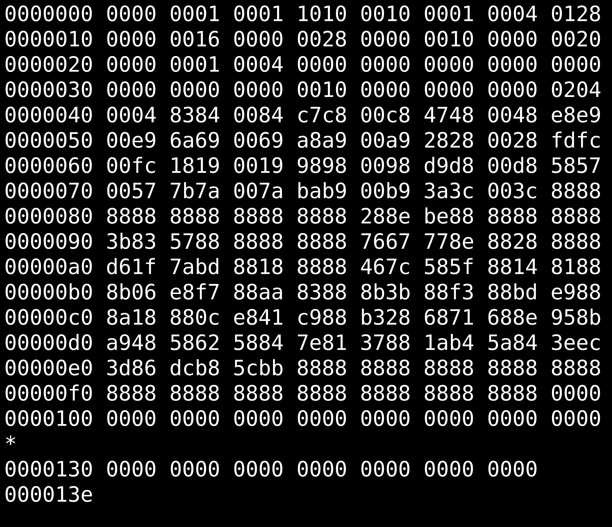

---

## Serialisation/Deserialisation

- Serialisation: Convert data from memory/object representation to a storable/transmittable format. Also called marshalling/flattening/pickling, etc.
- Deserialisation: Convert data from a storable/transmittable format back to memory/object representation.

## Frameworks/Standards

- JSON
- FlatBuffers
- Protocol Buffers
- Parquet
- etc

---

<!-- _class: columns -->

## Zero-copy

- #### Multiple Copies of the Same Data

  When data is processed on a machine, it is often copied multiple times.

  
  _([Zhenyuan (Zane) Zhang, 2024](https://medium.com/@kaixin667689/zero-copy-principle-and-implementation-9a5220a62ffd))_

- #### Zero-copy

  Zero-copy avoids data copying between memory locations, reducing I/O overhead. Formats like FlatBuffers enable direct access to serialised data without deserialisation.
  **Though the term "zero" is often used, it's not necessarily zero. It implies the data is copied much less than other approaches.**

---

<!-- _class: columns -->

## FlatBuffers and Other Formats

<!--  -->

- #### FlatBuffers

  FlatBuffers is a binary serialisation framework developed by Google.
  Its main characteristics are:

  - Binary format
  - Access to serialised data without parsing
  - Low memory consumption
  - Strictly typed (Schema driven)

- #### JSON

  Compared with FlatBuffers, JSON is:

  - Text-based (Human-readable and interoperable)
  - Needs to parse (copying data is needed)
  - More code to access data

---

<!-- _class: columns -->

## Spatial Indexing

- #### R-tree

  R-tree is a spatial index structure for 2D and 3D data.
  
  _([Wikipedia, 2025](https://en.wikipedia.org/wiki/R-tree))_

- #### Space-filling Curves

  Space-filling curves such as Hilbert curve map multi-dimensional data to one dimension while preserving spatial locality.
  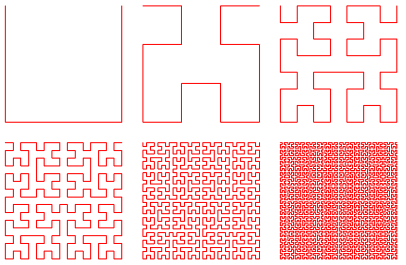
  _([m Williams, 2022](https://worace.works/2022/02/23/kicking-the-tires-flatgeobuf/))_

---

<!-- _class: columns -->

## B-Tree/B+Tree

B-Tree and its variants, B+Tree are self-balancing binary search trees.
With block size B, trees achieve log_B(n) instead of log_2(n) memory accesses.

- #### B-Tree

  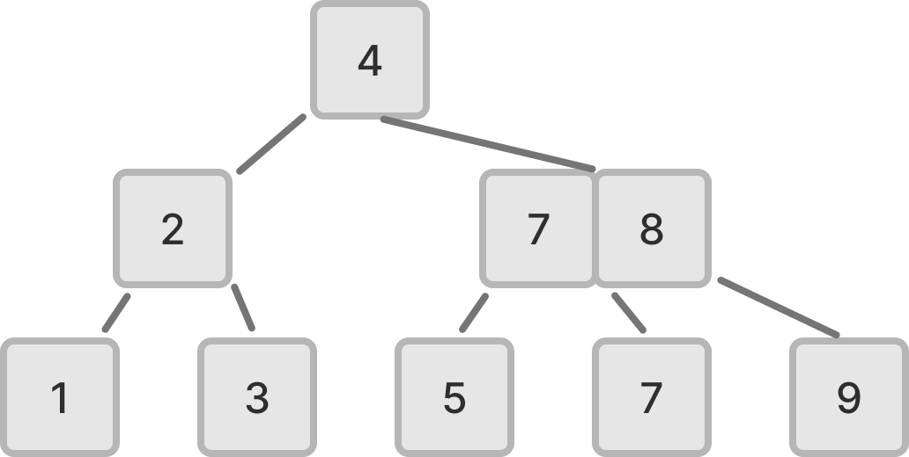

- #### B+Tree
  

---

# 3. Methodology

---

## 3.1 File Structure

The file consists of:

1. Magic Bytes: `FCB10000` (Acronym of FlatCityBuf + Semantic versioning)
2. Header: Common properties of CityJSON features and metadata (FlatBuffers root table)
3. Index:
   - Spatial Index: packed Hilbert R-tree
   - Attribute Index: static B+Tree
4. Features: array of CityJSON features (FlatBuffers root table)


---

## 3.2 Header

The header encodes:

- **Core fields**: CityJSON metadata (version, transform, reference system, geographical extent)
- **Appearance**: Materials, textures, UV coordinates
- **Geometry templates**: Reusable structures for compact representation
- **Extension support**: Embedded schemas for self-containment
- **Attribute schema**: Data structure for attributes
- **Indexing metadata**: Metadata for spatial and attribute indexing (e.g. offset bytes and branching factor)


---

## 3.3 Spatial Indexing (1/3): Structure

**Spatial Index in the file**


**Packed Hilbert R-tree**


_([m Williams, 2022](https://worace.works/2022/02/23/kicking-the-tires-flatgeobuf/))_

---

## 3.3 Spatial Indexing (2/3): Construction Steps

1. **Calculate bounding boxes**: Compute BBox for each feature
2. **Hilbert curve mapping**: Map BBox centres to Hilbert curve positions
3. **Sort by Hilbert value**: Order features to maintain spatial locality
4. **Build R-tree bottom-up**: Group features into leaf nodes, build parent nodes
5. **Pack into linear array**: Serialise tree into contiguous memory layout

---

<!-- _class: columns -->

## 3.3 Spatial Indexing (3/3): Supported Queries

### Spatial indexing in a streaming manner!

- #### Bounding Box

  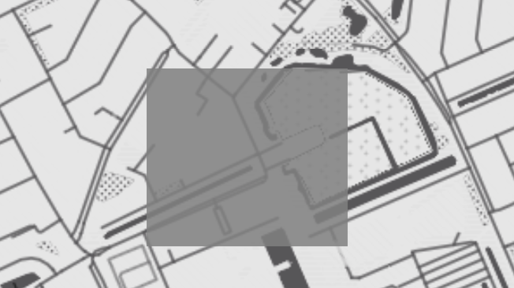

- #### Point/Nearest Neighbour

  

---

## 3.4 Attribute Indexing (1/3): Structure

**Attribute Index in the file**


**Static B+Tree**

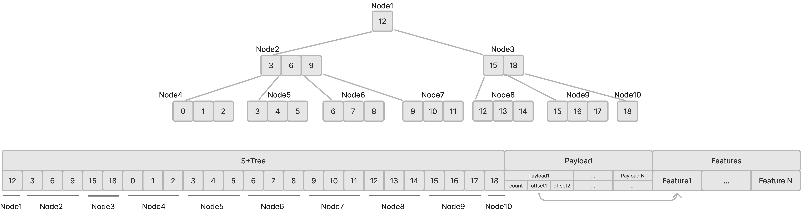

---

## 3.4 Attribute Indexing (2/3): Construction Steps

1. **Sort features by attribute**: Order features by the indexed attribute value (e.g. `1.apple`, `2.banana`, `3.cherry`)
2. **Build B+Tree bottom-up**: Create leaf nodes with sorted features, build internal nodes
3. **Store keys and pointers**: Internal nodes store keys and child pointers, leaves store actual data
4. **Pack into linear array**: Serialise tree structure for efficient disk storage
5. **Create index metadata**: Store root offset, node size, and branching factor

---

## 3.4 Attribute Indexing (3/3): Supported Queries

**Attribute indexing is also in a streaming manner!**

- **Exact Match Queries**

  - Find features with specific attribute values
  - Example: `city = "Tokyo"`

- **Range Queries**

  - Find features within attribute value ranges (`<`, `<=`, `>`, `>=`)
  - Example: `construction_year BETWEEN 1990 AND 2000`

- **Logical Combinations**

  - Find features that satisfy multiple conditions
  - Example: `(construction_year > 1990) AND (height > 100)`

---

## 3.5 Feature Encoding (1/3): Structure


- **Feature encoding preserves CityJSON structure with FlatBuffers efficiency**
  - **CityFeature**: city objects array, vertices, appearance data
  - **CityObject**: city object type, geometry, attributes, semantics, etc
  - **Flattened arrays**: Parallel structure for nested geometries

---

<!-- _class: columns -->

## 3.5 Feature Encoding (2/3): Geometry Encoding

FlatBuffers does not support nested arrays. We use flattened arrays to represent nested geometries.

- **Example (Triangle)**

  ```
  // Indices of three vertices
  boundaries : [0 , 1 , 2]
  // Single string with 3 vertices
  strings : [3]
  // Single surface containing 1 string
  surfaces : [1]
  ```

  

- **Example (Cube)**

  ```
  boundaries : [0 , 1 , 2 , 3 , 0 , 3 , 7 , 4 ...]
  strings : [4 , 4 , 4 , 4 , 4 , 4]
  surfaces : [1 , 1 , 1 , 1 , 1 , 1]
  shells : [6]
  solids : [1]
  ```

  

---

## 3.5 Feature Encoding (3/3): Attribute Encoding

Attributes are encoded with their own binary representation. (in little endian)


---

<!-- _class: columns -->

## 3.6 HTTP Range Requests

- HTTP Range Requests are used to retrieve only the necessary data from the file. Multiple HTTP Range Requests are sent to fetch only features users want.

- 

---

# 4. Results & Analysis

---

<!-- _class: columns -->

## 4.1 Outcomes (1/2): Software and Libraries

Developed a Rust library and its Command Line Interface (CLI) tool is available on [GitHub](https://github.com/flatcitybuf/flatcitybuf-rs).
Also its WASM bindings for TypeScript are available on [npm](https://www.npmjs.com/package/@flatcitybuf/flatcitybuf-wasm).

- 
- 

---

## 4.1 Outcomes (2/2): Web Prototype Demo

Web Prototype Demo: [https://fcb-web-prototype.netlify.app/](https://fcb-web-prototype.netlify.app/)

<video width="950" controls style="display: block; margin: 0 auto;">
  <source src="https://storage.googleapis.com/flatcitybuf/demo_1k.mov" type="video/mp4">
</video>

---

<!-- _class: columns -->

## 4.1 valuation Metrics

- #### File Size

  I compare the serialised file sizes of:

  - CityJSONSeq
  - FlatCityBuf
  - CBOR (JSON compatible binary format)
  - BSON (JSON compatible binary format)

- #### Read Performance on Local Machine

  - Time to iterate all features
  - Peak memory usage (RSS)

- #### Read Performance over Network (vs 3DBAG API)

  - Time for ID-based queries
  - Time for bounding box queries

---

## 4.2 File Size Comparison (1/3): Overview


---

<!-- _class: columns -->

## 4.2 File Size Comparison (2/3): Entire Netherlands

- 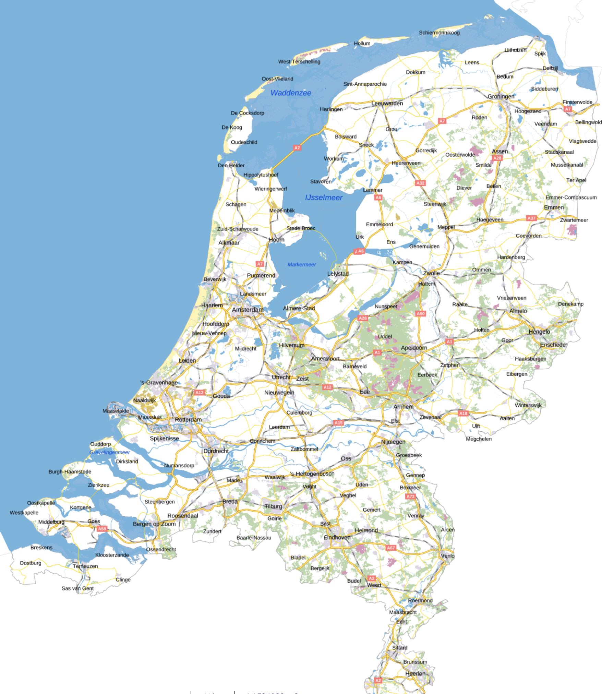
- #### 3DBAG's 10 million buildings are encoded in

  ### **70.4 GB** (single file)

  Data remains accessible for efficient subsetting despite the large file size.

  (Indexed all attributes; without index: 63.9GB. CityJSONSeq: 65.2GB - slightly smaller.)

---

<!-- _class: columns -->

## 4.2 File Size Comparison (3/3): Factors

- #### Key Factors:

  - **Level of Detail**: Minimal impact (~24-25% consistent compression)
  - **Attribute Quantity**: More attributes = better compression (5.07% → 44.13%)
  - **Geometric Complexity**: Complex geometries compress better (14.94% → 26.06%)
  - **Coordinate Scale**: Large coordinates favour FlatCityBuf (-28.65% → +17.79%)

- #### FlatCityBuf Achieves Better Compression When:

  - More attributes
  - Complex geometries
  - Large coordinate values

---

## 4.3 Local Environment Benchmarks (1/4): Overview

**Key findings:**

- FlatCityBuf consistently outperforms alternatives in both speed and memory efficiency
- 2-10x faster iteration compared to text-based formats (CityJSONSeq)
- 50-80% lower memory usage across all test cases
- Performance advantage increases with dataset complexity

---

## 4.3 Local Environment Benchmarks (2/4): vs CityJSONSeq

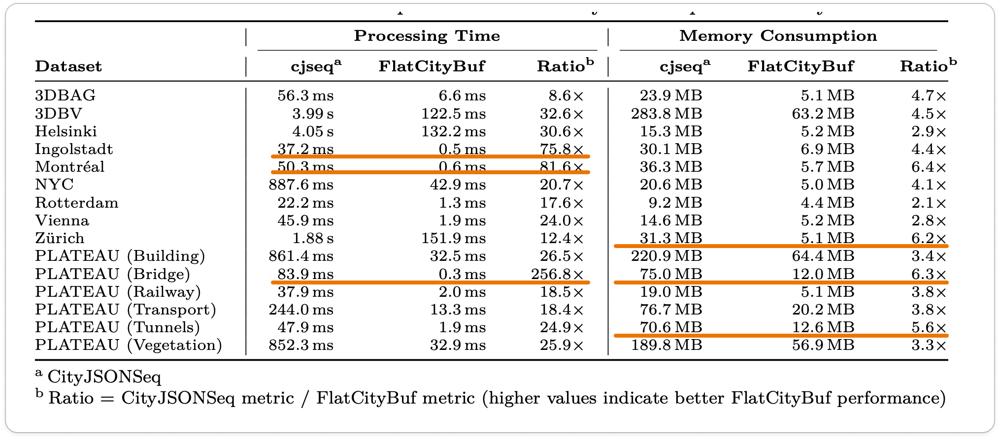

---

## 4.3 Local Environment Benchmarks (3/4): vs CBOR

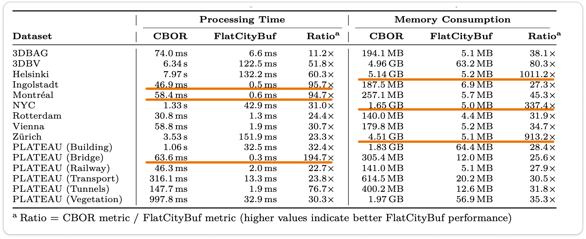

---

## 4.3 Local Environment Benchmarks (4/4): vs BSON


---

## 4.4 Web Environment Benchmarks vs 3DBAG API (1/2)

### ID Query


---

## 4.4 Web Environment Benchmarks vs 3DBAG API (2/2)

### Bounding Box Query


---

# 5. Discussion & Limitations

---

## 5.1 Discussion: Use Cases and Applications

- #### Flexible Data Download

  As the web application showed, users can download only features they want with given queries, even in a data format they prefer e.g. CityJSON, CityJSONSeq, OBJ, etc.

- #### Data Processing Applications

  As performance benchmarks showed, FlatCityBuf is particularly suitable for cases where data processing is I/O intensive such as 3DBAG generation pipeline.

---

<!-- _class: columns -->

## 5.2 Discussion: Impact on Server Architecture

- #### Traditional Server Architecture

  Complex, less scalable and expensive

  

- #### FlatCityBuf's Server Architecture

  Simple, scalable and cost-effective

  

---

<!-- _class: columns -->

## 5.3 Limitations and Trade-offs 1: Client-side Complexity

- #### Traditional Client Architecture Model

  
  _(Modified from [Alesheikh et al., 2002](https://www.isprs.org/proceedings/xxxiv/part4/pdfpapers/422.pdf))_

- #### FlatCityBuf Client Architecture Model

  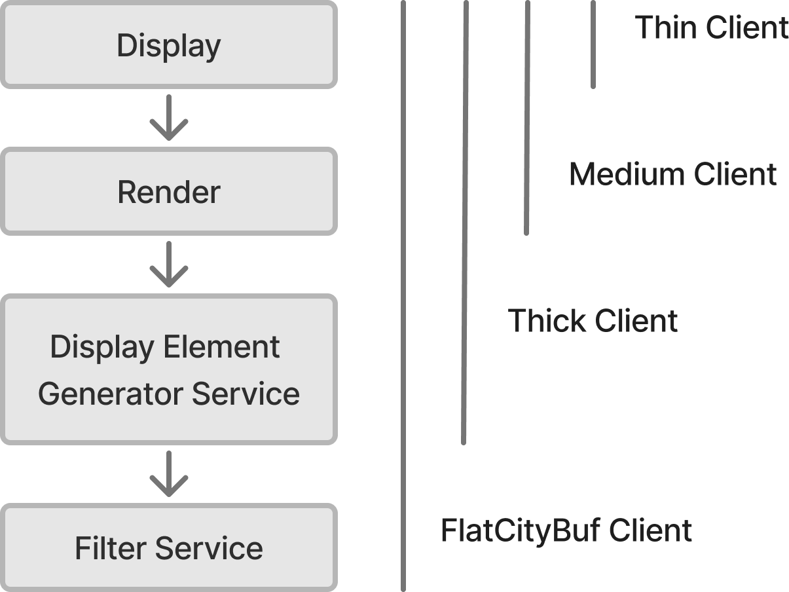

---

## 5.4 Limitations and Trade-offs 2: Update Operations

FlatCityBuf's immutable, read-only design makes update operations challenging compared to traditional mutable databases/file formats that support in-place modifications.

---

# 6. Conclusion and Future Work

---

<!-- _class: columns -->

## 6.1 Conclusion

FlatCityBuf: A cloud-optimised format for 3D city models

- **Key Contributions:**

  - Zero-copy deserialisation with spatial/attribute queries
  - HTTP Range Requests for efficient web streaming
  - Simpler, scalable server architecture

- **Limitations:**
  - Limited query flexibility
  - Higher client-side complexity
  - Challenging update operations

---

## 6.2 Future Work

- **Language Support**

  - Python, JavaScript, C++, etc
  - Performance testing across languages

- **Alternative Formats**

  - Apache Parquet exploration
  - Column-oriented format comparison

- **Web Viewers**
  - Geometric visualisation
  - Progressive loading

---

# Thank you!


---

# Appendix

---

# Appendix (Theoretical)

---

## Appendix (Theoretical): Eytzinger Layout (1/2)


---

## Appendix (Theoretical): Eytzinger Layout (2/2)

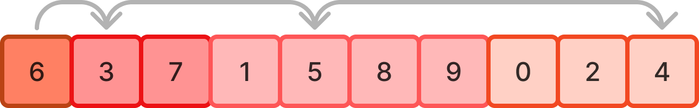

---

### Appendix (Theoretical): Column-oriented and Row-oriented storage

#### Example data

| id  | city      | country        |
| --- | --------- | -------------- |
| 1   | Tokyo     | Japan          |
| 2   | London    | United Kingdom |
| 3   | Amsterdam | Netherlands    |

#### Row-oriented storage

```
1, Tokyo, Japan , 2, London, UK, 3, Amsterdam, Netherlands
```

#### Column-oriented storage

```
1, 2, 3, Tokyo, London, Amsterdam, Japan, UK, Netherlands
```

---

<!-- _class: columns -->

## Appendix (Theoretical): Endianness

- #### Little Endian

  - Least significant byte is stored first
  - Example: 0x12345678
  - Stored as: 0x78 0x56 0x34 0x12
  - e.g. (31 December 2050) in calendar date format

- #### Big Endian
  - Most significant byte is stored first
  - Example: 0x12345678
  - Stored as: 0x12 0x34 0x56 0x78
  - e.g. (2025-12-31) in calendar date format

---

<!-- _class: columns -->

## Appendix (Theoretical): WebAssembly

- 
- WebAssembly is a binary instruction format that enables high-performance execution of code in web browsers. It allows languages like C, C++, and Rust to run at near-native speed on the web.

---

## Appendix (Theoretical): FlatBuffers


---

## Appendix A: File Size Comparison (Level of Detail)

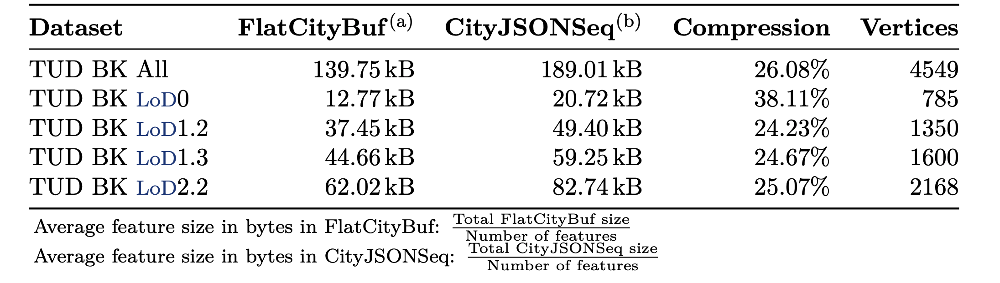

---

<!-- _class: columns -->

## Appendix A: File Size Comparison (Attribute Quantity)

- #### Data

  ```json
  {
    "type ": "Building",
    "geometry ": [ . . . ] ,
    "attributes ": {
    "attr_1": "value_1",
    "attr_2": "value_2",
    "attr_3": "value_3",
    "attr_4": "value_4",
    "attr_5": "value_5",
    ...
    "attr_n": " value_n"
    }
  }
  ```

- #### Result
  

---

<!-- _class: columns -->

## Appendix A: File Size Comparison (Geometric Complexity)

- #### Data

  

- #### Result

  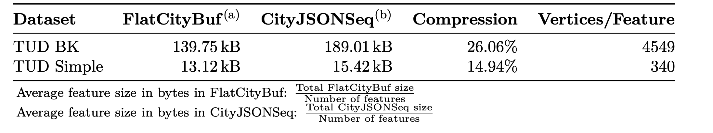

---

## Appendix A: File Size Comparison (Coordinate Scale)

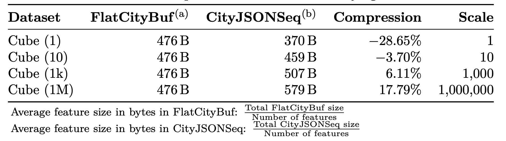
