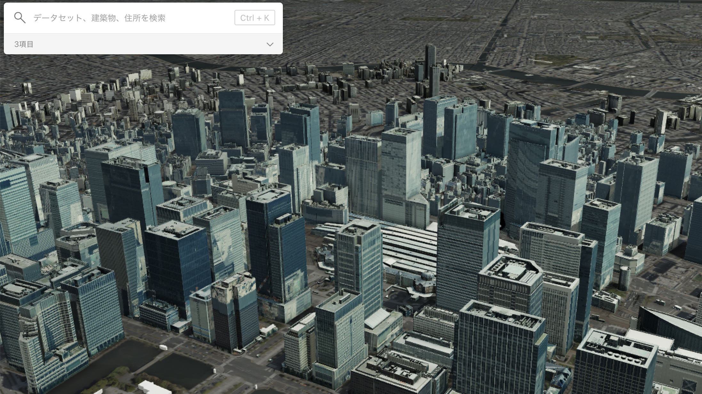

# FlatCityBuf: a new cloud-optimised CityJSON format

<!-- _class: columns -->

- ## Hidemichi Baba

  

  student #5967538
  h.baba@student.tudelft.nl

  - Responsible Supervisor: Hugo Ledoux
  - 2nd Supervisor: Ravi Peters
    18th June 2025

- 

---

<!-- _class: columns -->

## Index

- - **1. Background & Motivation**

    - What are 3D City Models?
    - Current Challenges in Cloud GIS
    - Why This Research Matters

  - **2. Theoretical Foundation**

    - Binary vs Text-Based Formats
    - Zero-Copy and Performance
    - Serialisation/Deserialisation and frameworks
    - FlatBuffers
    - Spatial Indexing
    - B-Tree/B+Tree

  - **3. Related Work**

    - CityGML and CityJSON
    - CityJSON and its variants
    - Cloud-Optimised Geospatial Formats
    - Research Gap Identification

- - **4. Research Objectives**

    - Primary Research Question
    - Technical Goals
    - Scope and Limitations

  - **5. FlatCityBuf Solution**

    - Technical Approach Overview
    - Key Innovations
    - File Structure Design

  - **6. Implementation & Results**

    - Performance Benchmarks
    - Web Prototype Demo
    - Real-World Comparisons

  - **7. Impact & Applications**

    - Use Cases and Benefits
    - Architecture Simplification
    - Cost Implications

  - **8. Discussion & Future Work**

    - Limitations and Trade-offs
    - Next Steps
    - Broader Implications

---

# 1. Background & Motivation

---

<!-- _class: columns -->

## What are 3D City Models?

Digital representations of urban environments including buildings, infrastructure, and terrain with rich semantic data.

- 
  _PLATEAU: Japan's national 3D city model initiative_

- 
  _3DBAG: Netherlands' comprehensive 3D building dataset_

---

<!-- _class: columns -->

## How are 3D City Models used?

- #### Example1: Solar Analysis

  
  _([Technical University of Munich](https://www.asg.ed.tum.de/en/gis/research-areas/cities-and-energy/), 2024)_

- #### Example2: Flood Simulation

  
  _([PLATEAU](https://plateauview.mlit.go.jp/), 2024)_

---

<!-- _class: columns -->

## Traditional Desktop GIS vs Cloud GIS

- ### Desktop GIS

  Desktop GIS uses data on the local machine.

  

- ### Cloud GIS

  Cloud GIS uses data transferred over the network.

  

---

<!-- _class: columns -->

## Common strategies for Cloud GIS

- 1. #### Tiling

  
  _Tile Map Service (TMS) standard_

  2. #### Spatial Indexing

     e.g. R-tree, quadtree, KD-tree

- 3. #### Data Simplification

  
  _([Roth et al., 2011](https://cartographicperspectives.org/index.php/journal/article/view/cp68-roth-et-al/html))_

  4. #### Compression
     e.g. Draco, or other binary formats

---

## Current Formats: Desktop → Cloud Gap

**Traditional Approach:**

- CityJSON/CityJSONSeq
- Text-based formats
- Designed for desktop use
- Full file parsing required

**Cloud Requirements:**

- Partial data access
- Fast query performance
- HTTP-friendly
- Scalable architecture

**The Gap:** No cloud-optimised standard for 3D city models

---

## Why This Research Matters

**Impact Areas:**

- 🏙️ Smart city applications
- 🌍 Digital twin platforms
- 📊 Urban analytics
- 🚨 Emergency response

**Benefits:**

- Faster data access
- Lower costs
- Better user experience
- Scalable solutions

**Goal:** Bridge the gap between desktop GIS and cloud-native 3D city models

---
