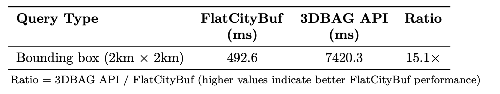
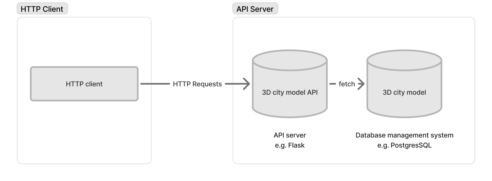

# FlatCityBuf: a new cloud-optimised CityJSON format

<!-- _class: columns -->

- 

- #### 馬場 英道 (Hidemichi Baba)

  

    Eukarya Inc.
    VP of Research and Development
    2025年7月

---

# Self Introduction

#### 馬場 英道 (Hidemichi Baba)

- Eukarya Inc. (VPoR&D)
- Delft University of Technology (PhD student)

#### Projects

- PLATEAU VIEW (Developer & PM)
- 空間ID x BIM (Dev)
- Project LINKS Veda, SOMA (Dev & PM)


---

<!-- _class: columns -->

## 目次

- - **1. 背景と動機**

    - 3D都市モデルとは？
    - CityJSONとCityJSONSeq
    - バイナリファイルとCloud GIS
    - Cloud-Optimised形式
    - 研究課題

  - **2. 手法**

    - FlatBuffersとZero-copy
    - ファイル構造設計
    - 空間・属性インデックス
    - Feature・Geometryの符号化
    - HTTP Range Requests

- - **3. 結果と分析**

    - ソフトウェア実装
    - ファイルサイズ比較
    - ローカル環境パフォーマンス
    - Web環境テスト

  - **4. ディスカッション&課題**

    - 使用事例と応用案
    - サーバーアーキテクチャへの影響
    - クライアントサイドの複雑さ
    - 更新操作

  - **5. 結論と今後の課題**

---

# 1. 背景と動機

---

<!-- _class: columns -->

## 1.1 3D都市モデル (1/3): 3D都市モデルとは？

建物、インフラ、地形を含む都市環境の3Dデジタル表現で、豊富なセマンティックデータを含む。

- 
  _PLATEAU: 日本の国家3D都市モデルプロジェクト_

- 
  _3DBAG: オランダ全土の3D建物データセット_

---

<!-- _class: columns -->

## 1.1 3D都市モデル (2/3): どのように使われるか？

- #### 例1: 太陽光解析

  
  _([Technical University of Munich](https://www.asg.ed.tum.de/en/gis/research-areas/cities-and-energy/), 2024)_

- #### 例2: 浸水シミュレーション

  
  _([PLATEAU](https://plateauview.mlit.go.jp/), 2024)_

---

<!-- _class: columns -->

## 1.1 3D都市モデル (3/3): どのように表現される？ (CityGMLとCityJSON)

- #### CityGML

  CityGMLは、セマンティック情報を持つ3D都市モデルを表現・交換するための概念モデル。

  
  _([CityGML 3.0.0](https://www.ogc.org/standards/citygml/))_

- #### CityJSON

  CityJSONは、CityGMLモデルをJSON形式で表現するためのOGCコミュニティスタンダード。

  
  _([CityJSON](https://www.cityjson.org/))_

---

<!-- _class: columns -->

## CityJSONの派生形式: CityJSONSeq

Ledoux et al., 2024は、featureをストリーミング方式で処理・配信できるようにCityJSON TextSequences (CityJSONSeq) を提案した。

Featureは個別のJSONオブジェクトに分解される。


_([Ledoux et al., 2024](https://isprs-archives.copernicus.org/articles/XLVIII-4-W11-2024/57/2024/))_

**しかし、まだ改善の余地がある！**

---

<!-- _class: columns -->

## バイナリファイル

- - バイナリファイルは、テキスト形式よりも優れた保存効率と高速処理を提供する。

  - もちろん、人間には読めない。

  - 一般的なテキスト形式: GeoJSON、CSV、CityGML、CityJSON

  - 一般的なバイナリ形式: GeoPackage、GeoTIFF等

- 

---

<!-- _class: columns -->

## 1.4 従来のDesktop GIS vs Cloud GIS

- ### Desktop GIS

  Desktop GISはローカルマシン上のデータを使用する。

  

- ### Cloud GIS

  Cloud GISはネットワーク経由で転送されるデータを使用する。

  

---

<!-- _class: columns -->

## 1.5 Cloud GISの利点と課題

- #### 利点

  - **グローバルアクセス** - どこからでもアクセス可能
  - **マルチユーザーコラボレーション** - 同時データアクセス
  - **クロスプラットフォーム互換性** - 任意のデバイスで動作
  - **スケーラブルなインフラ** - 変動する需要に対応
  - **ストレージ削減** - ローカルデータ保存が不要

- #### 課題

  - **ネットワーク依存** - 安定したインターネットが必要
  - **データ転送コスト** - 帯域消費
  - **レイテンシ問題** - ネットワーク遅延がパフォーマンスに影響
  - **セキュリティ懸念** - データが外部に保存される

---

<!-- _class: columns -->

## Cloud GISの一般的な戦略

- 1. #### タイリング

  
  _Tile Map Service (TMS) 標準_

  2. #### 空間インデックス

     例: R-tree、quadtree、KD-tree

- 3. #### データ簡略化

  
  _([Roth et al., 2011](https://cartographicperspectives.org/index.php/journal/article/view/cp68-roth-et-al/html))_

  4. #### 圧縮

     例: Draco、またはその他のバイナリ形式

---

<!-- _class: columns -->

## Cloud-OptimisedなGISデータの例 (2D)

- ### Cloud-Optimised

  Cloud-optimised地理空間形式は、地理空間データへの効率的なオンデマンドアクセスを可能にし、4つの主要な利点を提供する：

  - **低レイテンシ** - 部分的なデータ取得による
  - **スケーラビリティ** - 並列操作による
  - **柔軟性** - 高度なクエリ機能
  - **費用効率** - 最適化されたアクセスパターン

- ### 例

  - Cloud Optimised GeoTIFF
  - GeoParquet
  - PMTiles
  - FlatGeobuf
  - 3D Tiles
  - Mapbox Vector Tiles

---

## Cloud-Optimised地理空間形式の例 (2D): FlatGeobuf

<video width="1000" controls style="display: block; margin: 0 auto;">
  <source src="https://storage.googleapis.com/flatcitybuf/flatgeobuf_demo.mp4" type="video/mp4">
</video>

---

## Cloud-Optimised地理空間形式の例 (2D): FlatGeobuf

FlatGeobufは.png、.mp4、.geojson等のような静的ファイルである。
しかし、**bounding boxクエリで1部のデータのみを取得**することができる。

[Brandon Liu](https://x.com/bdon)曰く、
<br/>

> A Map is just a Video

---

## 3DBAGはどうか？

<!-- _class: center -->

3DBAGもデータダウンロードにタイリングを採用している。ユーザーは関心のある領域を含むタイルを選択する必要がある。（PLATEAUもしかり）


---

## 研究における仮説

### 3D都市モデルのためのcloud-optimisedなデータフォーマットが存在しない

### FlatGeobufと同じアイデアを3D都市モデルに適用できないか？

---

## 問い

### _"Web環境でのより高速なアクセス、低メモリ消費、柔軟なfeatureクエリのために、CityJSONSeq符号化をどのように最適化できるか？"_

---

## その他の問い

- **RQ1:** セマンティックを維持しながら、CityJSONSeqのすべてのコンポーネントを効率的に表現するFlatBuffersスキーマをどのように設計できるか？

- **RQ2:** 最適化されたインデックス構造を通じて、空間・属性クエリで高速なデータ検索をどのように実現できるか？

- **RQ3:** バイナリシリアライゼーションを使用したHTTP Range Requestsでウェブベースのデータサブセット取得を効率的に実装するにはどうすればよいか？

提案する**FlatCityBuf**形式は、FlatBuffersのバイナリシリアライゼーションとHTTP Range Requestsを組み合わせ、CityJSONのセマンティックな豊富さを維持しながら、読み取りパフォーマンスを最大化する。

---

# 2. 手法

---

## 2.1 FlatBuffers(1/3): シリアライゼーション/デシリアライゼーション

- シリアライゼーション: データをメモリ/オブジェクト表現から保存/伝送可能な形式に変換する。マーシャリング/フラット化/ピックリング等とも呼ばれる。
- デシリアライゼーション: 保存/伝送可能な形式からメモリ/オブジェクト表現にデータを変換する。

### フレームワーク/標準

- JSON
- FlatBuffers
- Protocol Buffers
- Parquet
- 等

---

<!-- _class: columns -->

## 2.1 FlatBuffers(2/3): 基本的なアイデア

<!--  -->

- #### FlatBuffers

  FlatBuffersはGoogleが開発したバイナリシリアライゼーションフレームワーク。
  主な特徴：

  - バイナリ形式
  - 解析なしでシリアライゼーションされたデータへのアクセス
  - 低メモリ消費
  - 厳密に型付け（スキーマ駆動）

- #### JSON

  FlatBuffersと比較して、JSONは：

  - テキストベース（人間が読める、相互運用可能）
  - 解析が必要（データのコピーが必要）
  - データアクセスのためのより多くのコード

---

<!-- _class: columns -->

## 2.1 FlatBuffers(3/3): Zero-copy

- #### 同じデータの複数のコピー

  マシンでデータが処理されるとき、何度もデータがコピーされる。

  
  _([Zhenyuan (Zane) Zhang, 2024](https://medium.com/@kaixin667689/zero-copy-principle-and-implementation-9a5220a62ffd))_

- #### Zero-copy

  Zero-copyは、メモリアドレス間でのデータコピーを避け、I/Oオーバーヘッドを削減する。FlatBuffersのような形式は、デシリアライゼーションなしでシリアライゼーションされたデータへの直接アクセスを可能にする。
  **「zero」という用語がしばしば使われるが、必ずしもゼロではない。他のアプローチよりもデータのコピーが大幅に少ないことを意味する。**

---

## 2.2 ファイル構造

ファイルは以下で構成される：

1. Magic Bytes: `FCB10000` (FlatCityBufの略称 + セマンティックバージョニング)
2. Header: CityJSON featuresの共通プロパティとメタデータ (FlatBuffers root table)
3. Index:
   - 空間インデックス: packed Hilbert R-tree
   - 属性インデックス: static B+Tree
4. Features: CityJSON featuresの配列 (FlatBuffers root table)


---

## 2.3 Header

Headerは以下を符号化する：

- **コアフィールド**: CityJSONメタデータ（バージョン、変換、参照システム、地理的範囲）
- **Appearance**: マテリアル、テクスチャ、UV座標
- **Geometry Template**: コンパクトな表現のための再利用可能構造
- **Extension Support**: 自己記述式のための埋め込みスキーマ
- **Attribute Schema**: 属性のデータスキーマ
- **Index Metadata**: 空間・属性インデックスのメタデータ（例：オフセットバイト、ブランチングファクターなど）


---

<!-- _class: columns -->

## 2.4 空間インデックス (1/4): 基本的なアイデア

- #### R-tree

  R-treeは2D・3Dデータの空間インデックス構造。
  
  _([Wikipedia, 2025](https://en.wikipedia.org/wiki/R-tree))_

- #### Space-filling curve

  Hilbert曲線などのSpace-filling curveは、空間的局所性を保持しながら多次元データを一次元にマッピングする。

  
  _([m Williams, 2022](https://worace.works/2022/02/23/kicking-the-tires-flatgeobuf/))_

---

## 2.4 空間インデックス (2/4): 構造

**ファイル内の空間インデックス**


**Packed Hilbert R-tree**


_([m Williams, 2022](https://worace.works/2022/02/23/kicking-the-tires-flatgeobuf/))_

---

## 2.4 空間インデックス (3/4): 構築手順

1. **Bounding Box計算**: 各featureのBBoxを計算
2. **Hilbert曲線マッピング**: BBox中心をHilbert曲線にマッピング
3. **Hilbert値でソート**: 空間的関係を維持するためfeatureを順序付け
4. **Bottom-upでR-tree構築**: featureをリーフノードにグループ化、親ノードを構築
5. **1次元配列にパック**: ツリーを連続メモリレイアウトにシリアライズ

---

<!-- _class: columns -->

## 2.4 空間インデックス (4/4): サポートされるクエリ

### ストリーミング方式での空間インデックス

- #### Bounding Box

  

- #### Point/Nearest Neighbor

  

---

## 2.5 属性インデックス (1/3): 構造

**ファイル内の属性インデックス**


**Static B+Tree**


---

## 2.5 属性インデックス (2/3): 構築手順

1. **属性でfeaturesをソート**: インデックス化する属性値でfeaturesを順序付け（例：`1.apple`、`2.banana`、`3.cherry`）
2. **ボトムアップでB+Tree構築**: ソートされたfeaturesでリーフノードを作成、内部ノードを構築
3. **キーとポインタを格納**: 内部ノードはキーと子ポインタを格納、リーフは実際のデータを格納
4. **1次元配列にパック**: 効率的なディスク保存のためツリー構造をシリアライズ
5. **インデックスメタデータ作成**: ルートオフセット、ノードサイズ、ブランチングファクターを格納

---

## 2.5 属性インデックス (3/3): サポートされるクエリ

**属性インデックスもストリーミング方式！**

- **完全一致クエリ**

  - 特定の属性値を持つfeaturesを検索
  - 例: `city = "Tokyo"`

- **範囲クエリ**

  - 属性値の範囲内のfeaturesを検索（`<`, `<=`, `>`, `>=`）
  - 例: `construction_year BETWEEN 1990 AND 2000`

- **論理結合**

  - 複数の条件を満たすfeaturesを検索
  - 例: `(construction_year > 1990) AND (height > 100)`

---

## 2.6 Feature符号化 (1/3): 構造


- **Feature符号化はFlatBuffersの効率性でCityJSON構造を保持**
  - **CityFeature**: city objectsの配列、頂点、Appearanceデータ
  - **CityObject**: city objectタイプ、ジオメトリ、属性、セマンティクス等
  - **Flattened Array**: ネストしたジオメトリの並列構造

---

<!-- _class: columns -->

## 2.6 Feature符号化 (2/3): ジオメトリ符号化

FlatBuffersはネストした配列をサポートしない。ネストしたジオメトリを表現するためにFlattened Arrayを使用する。

- **例 (三角形)**

  ```
  boundaries : [0 , 1 , 2]
  strings : [3]
  surfaces : [1]
  ```

  

- **例 (立方体)**

  ```
  boundaries : [0 , 1 , 2 , 3 , 0 , 3 , 7 , 4 ...]
  strings : [4 , 4 , 4 , 4 , 4 , 4]
  surfaces : [1 , 1 , 1 , 1 , 1 , 1]
  shells : [6]
  solids : [1]
  ```

  

---

## 2.6 Feature符号化 (3/3): 属性符号化

属性は独自のバイナリ表現で符号化される。（Little Endian）


---

<!-- _class: columns -->

## 2.7 HTTP Range Requestsによるデータアクセス

- HTTP Range Requestsは、ファイルから必要なデータのみを取得するために使用される。ユーザーが必要とするfeaturesのみを取得するため、複数のHTTP Range Requestsが送信される。

- 

---

# 3. 結果と分析

---

<!-- _class: columns -->

## 3.1 成果物 (1/3): ソフトウェアとライブラリ

- 
  FlatCityBufコアライブラリ（Rust）[crates.io](https://crates.io/crates/fcb_core)で公開
- 
  FlatCityBuf CLIツール（Rust）[crates.io](https://crates.io/crates/fcb_cli)で公開
- 
  FlatCityBuf WASM TypeScriptバインディング[npm](https://www.npmjs.com/package/fcb_wasm)で公開

---

## 3.1 成果物 (2/3): コマンドラインインターフェース

**インストール**

```
cargo install fcb_cli
```

**シリアライゼーション**

```
fcb ser -i delft.city.jsonl  -o delft_attr.fcb
```

**デシリアライゼーション**

```
fcb deser -i delft_attr.fcb -o delft_attr.city.jsonl
```

---

<!-- _class: columns -->

## 3.1 成果物 (3/3): Webプロトタイプデモ

Webプロトタイプデモ: [https://fcb-web-prototype.netlify.app/](https://fcb-web-prototype.netlify.app/)

<video width="950" controls style="display: block; margin: 0 auto;">
  <source src="https://storage.googleapis.com/flatcitybuf/demo_1k.mov" type="video/mp4">
</video>

---

## 3.1 評価指標

- **ファイルサイズ**

  FlatCityBufとCityJSONSeqのシリアライゼーションファイルサイズを比較する。

- **ローカルマシンでの読み取りパフォーマンス**

  - 指標: 全features読み込み時間、ピークメモリ使用量（RSS）

  - 形式:
    - CityJSONSeq
    - CBOR（JSON互換バイナリ形式）
    - BSON（JSON互換バイナリ形式）

- **ネットワーク経由での読み取りパフォーマンス（vs 3DBAG API）**

  - IDベースクエリの時間
  - バウンディングボックスクエリの時間

---

## 3.2 ファイルサイズ比較 (1/3): 概要


---

<!-- _class: columns -->

## 3.2 ファイルサイズ比較 (2/3): オランダ全土

- 

- #### 3DBAGの1000万棟の建物が以下でシリアライズされる

  ### **70.8 GB**（単一ファイル）

  大きなファイルサイズにもかかわらず、効率的なサブセット化のためデータはアクセス可能のまま。

  （全属性をインデックス化；インデックスなし：63.9GB。CityJSONSeq：65.2GB - わずかに小さい。）

---

<!-- _class: columns -->

## 3.2 ファイルサイズ比較 (3/3): 要因

- #### 主要要因

  - **詳細レベル**: 最小限の影響（約24-25%一貫した圧縮）
  - **属性量**: 属性が多いほど圧縮率が向上（5.07% → 44.13%）
  - **ジオメトリ複雑さ**: 複雑なジオメトリほど圧縮率が向上（14.94% → 26.06%）
  - **座標スケール**: 大きな座標はFlatCityBufに有利（-28.65% → +17.79%）

- #### FlatCityBufが優れた圧縮を実現する条件

  - より多くの属性
  - 複雑なジオメトリ
  - 大きな座標値

---

## 3.3 ローカル環境ベンチマーク (1/4): 概要

**主要な知見:**

- FlatCityBufは速度とメモリ効率の両方で代替手段を一貫して上回る
- テキストベース形式（CityJSONSeq）と比較して2-10倍高速な反復
- 全テストケースで50-80%低いメモリ使用量
- パフォーマンスの優位性はデータセットの複雑さとともに増加

---

## 3.3 ローカル環境ベンチマーク (2/4): vs CityJSONSeq

**読み取り時間のベストケース**

読み取り時間はCityJSONSeqより**8.6-256.8倍**高速。

| データセット         | CityJSONSeq | FlatCityBuf | 比率   |
| -------------------- | ----------- | ----------- | ------ |
| Ingolstadt           | 37.2 ms     | 0.5 ms      | 75.8x  |
| Montreal             | 50.3 ms     | 0.6 ms      | 81.6x  |
| PLATEAU (Bridge)     | 83.9 ms     | 0.3 ms      | 256.8x |

**メモリ使用量のベストケース**

メモリ使用量はCityJSONSeqより**2.1-6.3倍**効率的。

| データセット          | CityJSONSeq | FlatCityBuf | 比率  |
| --------------------- | ----------- | ----------- | ----- |
| Zurich                | 31.3 MB     | 5.1 MB      | 6.2x  |
| PLATEAU (Bridge)      | 75 MB       | 12 MB       | 6.3x  |
| PLATEAU (Tunnels)     | 70.6 MB     | 12.6 MB     | 5.6x  |

---

## 3.3 ローカル環境ベンチマーク (3/4): vs CBOR

**読み取り時間のベストケース**

読み取り時間はCBORより**11.2-194.7倍**高速。

| データセット         | CityJSONSeq | FlatCityBuf | 比率   |
| -------------------- | ----------- | ----------- | ------ |
| Ingolstadt           | 46.9 ms     | 0.5 ms      | 95.7x  |
| Montreal             | 58.4 ms     | 0.6 ms      | 94.7x  |
| PLATEAU (Bridge)     | 63.6 ms     | 0.3 ms      | 194.7x |

**メモリ使用量のベストケース**

メモリ使用量はCBORより**27.3-1011.2倍**効率的。

| データセット | CityJSONSeq | FlatCityBuf | 比率    |
| ------------ | ----------- | ----------- | ------- |
| Helsinki     | 5.14 GB     | 5.2 MB      | 1011.2x |
| NYC          | 1.65 GB     | 5.0 MB      | 337.4x  |
| Zürich       | 4.51 GB     | 5.1 MB      | 913.2x  |

---

## 3.3 ローカル環境ベンチマーク (4/4): vs BSON

**読み取り時間のベストケース**

読み取り時間はBSONより**11.2-194.7倍**高速。

| データセット         | CityJSONSeq | FlatCityBuf | 比率   |
| -------------------- | ----------- | ----------- | ------ |
| Ingolstadt           | 79.9 ms     | 0.5 ms      | 163.1x |
| Montréal             | 151.3 ms    | 0.6 ms      | 245.5x |
| PLATEAU (Bridge)     | 177.0 ms    | 0.3 ms      | 541.8x |

**メモリ使用量のベストケース**

メモリ使用量はBSONより**38.9-1409.0倍**効率的。

| データセット | CityJSONSeq | FlatCityBuf | 比率    |
| ------------ | ----------- | ----------- | ------- |
| Helsinki     | 6.77 GB     | 5.2 MB      | 1331.7x |
| NYC          | 2.50 GB     | 5.0 MB      | 510.7x  |
| Zürich       | 6.97 GB     | 5.1 MB      | 1409.0x |

---

## 3.4 Web環境ベンチマーク vs 3DBAG API (1/2)

### IDクエリ


---

## 3.4 Web環境ベンチマーク vs 3DBAG API (2/2)

### バウンディングボックスクエリ



---

# 4. 議論と課題

---

## 4.1 議論: 活用可能性

- #### 柔軟なデータダウンロード

  Webアプリケーションが示したように、ユーザーは与えられたクエリで必要なfeaturesのみをダウンロードでき、CityJSON、CityJSONSeq、OBJ等、好みのデータ形式でも可能。

- #### データ処理アプリケーション

  パフォーマンスベンチマークが示したように、FlatCityBufは3DBAG生成パイプラインなど、データ処理がI/O集約的な場合に特に適している。

---

<!-- _class: columns -->

## 4.2 議論: サーバーアーキテクチャへの影響

- #### 従来のサーバーアーキテクチャ

  複雑で、スケーラビリティが低く、高価

  

- #### FlatCityBufのサーバーアーキテクチャ

  シンプル、スケーラブル、安価

  

---

<!-- _class: columns -->

## 4.3 課題: クライアントサイドの複雑さ

- #### 従来のクライアントアーキテクチャモデル

  
  _([Alesheikh et al., 2002](https://www.isprs.org/proceedings/xxxiv/part4/pdfpapers/422.pdf)より修正)_

- #### FlatCityBufクライアントアーキテクチャモデル

  

---

## 4.4 課題: 更新操作

FlatCityBufの不変・読み取り専用設計は、インプレース変更をサポートする従来の可変データベース/ファイル形式と比較して、更新操作を困難にする。

---

# 5. 結論と課題

---

<!-- _class: columns -->

## 5.1 結論

FlatCityBuf: 3D都市モデルのためのcloud-optimised形式

- **主要な成果:**

  - 空間/属性クエリを持つZero-copyデシリアライゼーション
  - 効率的なWebストリーミングのためのHTTP Range Requests
  - よりシンプルでスケーラブルなサーバーアーキテクチャ

- **課題:**
  - 限定的なクエリ柔軟性
  - 高いクライアントサイドの複雑さ
  - 困難な更新操作

---

## 5.2 課題

- **言語サポート**

  - Python、JavaScript、C++等
  - 言語間のパフォーマンステスト

- **代替形式**

  - Apache Parquetの探索
  - 列指向形式の比較

- **Webビューア**
  - ジオメトリ可視化
  - プログレッシブローディング

---

# Thank you


---

# 付録

---

# 付録 (理論)

---

## 付録 (理論): Eytzinger Layout (1/2)


---

## 付録 (理論): Eytzinger Layout (2/2)


---

### 付録 (理論): 列指向と行指向ストレージ

#### データ例

| id  | city      | country        |
| --- | --------- | -------------- |
| 1   | Tokyo     | Japan          |
| 2   | London    | United Kingdom |
| 3   | Amsterdam | Netherlands    |

#### 行指向ストレージ

```
1, Tokyo, Japan , 2, London, UK, 3, Amsterdam, Netherlands
```

#### 列指向ストレージ

```
1, 2, 3, Tokyo, London, Amsterdam, Japan, UK, Netherlands
```

---

<!-- _class: columns -->

## 付録 (理論): エンディアンネス

- #### リトルエンディアン

  - 最下位バイトが最初に格納される
  - 例: 0x12345678
  - 格納: 0x78 0x56 0x34 0x12
  - 例: カレンダー日付形式での（2050年12月31日）

- #### ビッグエンディアン

  - 最上位バイトが最初に格納される
  - 例: 0x12345678
  - 格納: 0x12 0x34 0x56 0x78
  - 例: カレンダー日付形式での（2025-12-31）

---

<!-- _class: columns -->

## B-Tree/B+Tree

B-Treeとその派生形式のB+Treeは、自己平衡二分探索木である。
ブロックサイズBで、ツリーはlog_2(n)ではなくlog_B(n)メモリアクセスを実現する。

- #### B-Tree

  

- #### B+Tree

  

---

<!-- _class: columns -->

## 付録 (理論): WebAssembly

- 
- WebAssemblyは、Webブラウザでコードの高性能実行を可能にするバイナリ命令形式。C、C++、Rustなどの言語がWeb上でほぼネイティブ速度で実行できる。

---

## 付録 (理論): FlatBuffers


---

## 付録: 研究範囲

- **範囲内:**

  - FlatCityBuf形式の設計と実装（Rust）
  - 空間・属性インデックス
  - HTTP Range Requestデータ取得
  - CityJSONSeqとのパフォーマンス評価
  - Webベースのデモ

- **範囲外:**
  - 他のプログラミング言語でのライブラリ実装
  - ParquetやProtocol Buffersなどの代替シリアライゼーションフレームワークの探索
  - 書き込み操作の最適化

---

## 付録 A: ファイルサイズ比較（詳細レベル）


---

<!-- _class: columns -->

## 付録 A: ファイルサイズ比較（属性量）

- #### データ

  ```json
  {
    "type ": "Building",
    "geometry ": [ . . . ] ,
    "attributes ": {
    "attr_1": "value_1",
    "attr_2": "value_2",
    "attr_3": "value_3",
    "attr_4": "value_4",
    "attr_5": "value_5",
    ...
    "attr_n": " value_n"
    }
  }
  ```

- #### 結果

  

---

<!-- _class: columns -->

## 付録 A: ファイルサイズ比較（ジオメトリ複雑さ）

- #### データ

  

- #### 結果

  

---

## 付録 A: ファイルサイズ比較（座標スケール）


---

## 付録 A: 読み取りパフォーマンス（vs CityJSONSeq）


---

## 付録 A: 読み取りパフォーマンス（vs CBOR）


